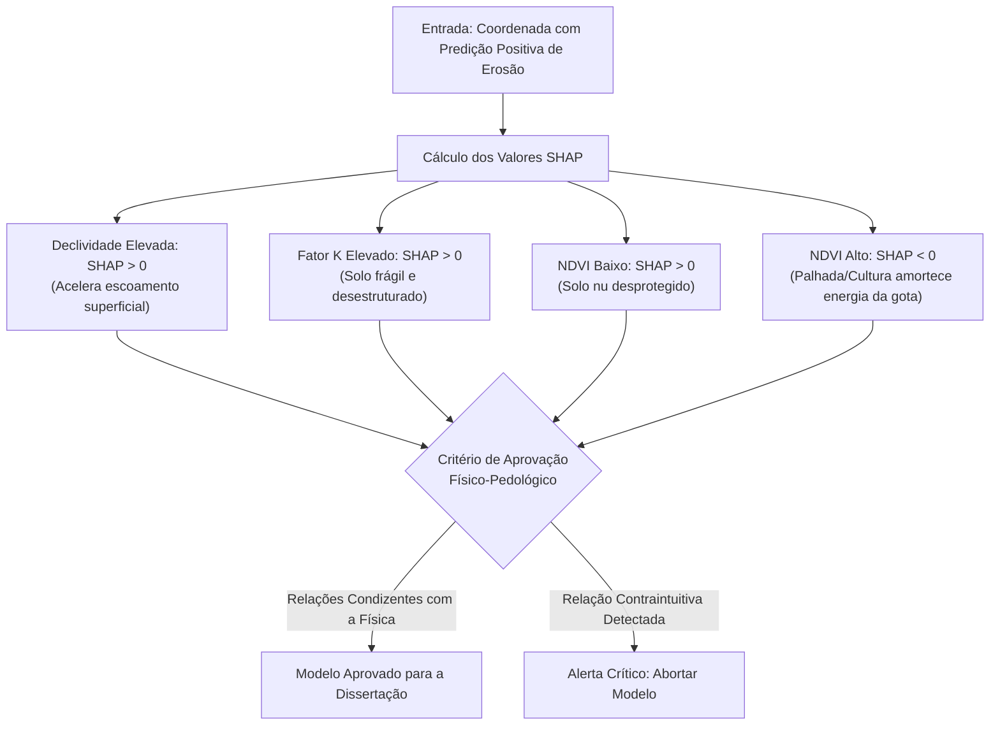

# Demonstração, Transparência Metodológica e Explicabilidade Física dos Cálculos (SAREL)

**Programa de Pós-Graduação em Tecnologias Computacionais para o Agronegócio (PPGTCA / UEL-UEM-UFPR)**  
**Projeto de Dissertação:** Sistema Automatizado de Reconhecimento de Risco de Erosão Laminar (SAREL)  
**Data:** 23 de Setembro de 2026  
**Finalidade:** Documento de Transparência Algorítmica e Blindagem Metodológica para a Banca Examinadora

---

## 1. Princípio da "Caixa de Vidro" (*Glass-Box Architecture*)

A modelagem de processos hidrogeomorfológicos e de degradação ambiental não pode apoiar-se em modelos opacos do tipo "caixa-preta". Para que a dissertação de mestrado possua solidez científica irrefutável perante a banca examinadora e revisores de periódicos internacionais (*Catena*, *Geoderma*, *Remote Sensing of Environment*), a plataforma **SAREL** adota o princípio da **Arquitetura de Caixa de Vidro**.

Esse princípio estabelece três mandamentos inegociáveis:
1. **Todas as variáveis possuem formulação física explícita**, com unidades do Sistema Internacional (SI) rigorosamente tipadas;
2. **Nenhum número entra no modelo sem selo de proveniência rastreável** (*data lineage*), sendo expressamente proibido preencher ausências com valores médios arbitrários ou gerados por funções aleatórias;
3. **As predições de inteligência artificial são auditadas fisicamente** por meio de valores aditivos de Shapley (SHAP), comprovando que o modelo respeita as leis da conservação de massa e mecânica dos solos.

---

## 2. As 12 Formulações Matemáticas Canônicas

Todos os cálculos processados pelo sistema derivam do compêndio de 12 formulações físicas e estatísticas canônicas:

```mermaid
flowchart LR
    subgraph Espacial["1. Sensoriamento Remoto & Espectrometria"]
        F1["F1: NDVI (Rouse et al., 1974)"]
        F2["F2: BSI (Diek et al., 2017)"]
        F3["F3: Harmônicos OLS (Shumway & Stoffer, 2017)"]
        F4["F4: Frequência Solo Nu (Demattê et al., 2018)"]
    end

    subgraph Mecanismo["2. Físico-Mecânica dos Solos (RUSLE & G2)"]
        F5["F5: Fator C Tropical (Durigon et al., 2014)"]
        F6["F6: Fator K Embrapa (Coelho et al., 2024)"]
        F7["F7: Perda de Solo A (Renard et al., 1997)"]
        F8["F8: Índice G2 (Karydas et al., 2014)"]
    end

    subgraph IA["3. Aprendizado de Máquina & Validação"]
        F9["F9: Função Objetivo XGBoost (Chen & Guestrin, 2016)"]
        F10["F10: Ganho de Split Regularizado"]
        F11["F11: Kappa de Cohen (Cohen, 1960)"]
        F12["F12: Explicabilidade SHAP (Lundberg & Lee, 2017)"]
    end

    Espacial --> Mecanismo --> IA
```



### 2.1. Índice de Vegetação por Diferença Normalizada (NDVI)
$$\text{NDVI} = \frac{\rho_{\text{NIR}} - \rho_{\text{Red}}}{\rho_{\text{NIR}} + \rho_{\text{Red}}} = \frac{B8 - B4}{B8 + B4}$$
* **Domínio:** $[-1{,}0; +1{,}0]$ (Adimensional).
* **Fundamentação:** Rouse et al. (1974). Mede o vigor fotossintético e a densidade foliar protetora contra o impacto de gotas de chuva (*splash*).

### 2.2. Índice de Solo Exposto (*Bare Soil Index* — BSI)
$$\text{BSI} = \frac{(\rho_{\text{SWIR1}} + \rho_{\text{Red}}) - (\rho_{\text{NIR}} + \rho_{\text{Blue}})}{(\rho_{\text{SWIR1}} + \rho_{\text{Red}}) + (\rho_{\text{NIR}} + \rho_{\text{Blue}})} = \frac{(B11 + B4) - (B8 + B2)}{(B11 + B4) + (B8 + B2)}$$
* **Domínio:** $[-1{,}0; +1{,}0]$ (Adimensional).
* **Fundamentação:** Diek et al. (2017). Realça a resposta mineral do solo desprovido de cobertura vegetal.

### 2.3. Decomposição Harmônica de Séries Temporais (Regressão OLS)
$$\hat{y}(t) = c_0 + c_1 t + \sum_{k=1}^m \left[ a_k \cos\left(\frac{2\pi k t}{T}\right) + b_k \sin\left(\frac{2\pi k t}{T}\right) \right]$$
* **Unidade:** $t$ em frações de ano; $c_1$ em $\text{ano}^{-1}$; amplitudes $A_k = \sqrt{a_k^2 + b_k^2}$ (Adimensional).
* **Fundamentação:** Shumway & Stoffer (2017). Modela o ciclo fenológico das culturas agrícolas e captura a tendência linear secular de degradação da biomassa no infravermelho de ondas curtas (SWIR).

### 2.4. Frequência Multianual de Solo Nu ($\hat{E}$)
$$\hat{E} = \frac{1}{N} \sum_{i=1}^N \mathbb{I}(\text{NDVI}_i \le 0{,}25)$$
* **Domínio:** $[0{,}0; 1{,}0]$ (Adimensional, fração temporal).
* **Fundamentação:** Demattê et al. (2018); Althoff et al. (2020). Proporção temporal em que o solo agrícola permaneceu em estado crítico de suscetibilidade ao cisalhamento hídrico superficial.

### 2.5. Fator C de Uso e Manejo do Solo (Tropical Regional)
$$C = \left( \frac{1 - \text{NDVI}}{2} \right)^{(1 + \text{NDVI})}$$
* **Domínio:** $[0{,}0; 1{,}0]$ (Adimensional).
* **Fundamentação:** Durigon et al. (2014); Van der Knijff et al. (2000). Relaciona a cobertura vegetal contínua com a atenuação da perda de solo em bacias tropicais brasileiras.

### 2.6. Fator K Numérico Contínuo de Erodibilidade do Solo
Conversão analítica da carta pedológica oficial da Embrapa Solos (Documentos 246/2024, Tabela 5, p. 13–15):
$$K \in \{0{,}0052; 0{,}0117; 0{,}0218; 0{,}0360; 0{,}0518\}\ \text{t}\cdot\text{h}\cdot\text{MJ}^{-1}\cdot\text{mm}^{-1}$$
* **Fundamentação:** Coelho et al. (2024); Mannigel et al. (2002). Resolve a incompatibilidade entre classes ordinais descritivas e a física da RUSLE, convertendo classes ordinais da Embrapa em valores numéricos empíricos contínuos.

### 2.7. Perda Média Anual de Solo (RUSLE)
$$A = R \times K \times LS \times C \times P$$
* **Unidade:** $A$ em $\text{t}\cdot\text{ha}^{-1}\cdot\text{ano}^{-1}$.
* **Fundamentação:** Renard et al. (1997). Linha de base físico-conceitual empírica contra a qual as predições supervisionadas são confrontadas.

### 2.8. Índice de Mecanismo Dinâmico (Modelo G2)
$$I_{\text{mecanismo}} = \sum_{t=1}^T \left( R_t \times \mathbb{I}(\text{NDVI}_t \le 0{,}25) \right)$$
* **Unidade:** $\text{MJ}\cdot\text{mm}\cdot\text{ha}^{-1}\cdot\text{h}^{-1}\cdot\text{mês}^{-1}$.
* **Fundamentação:** Karydas et al. (2014). Captura a coincidência crítica e simultânea de precipitação torrencial extrema sobre solo desprotegido.

### 2.9. Função Objetivo Regularizada do XGBoost
$$\mathcal{L}^{(t)} \approx \sum_{i=1}^n \left[ g_i f_t(x_i) + \frac{1}{2} h_i f_t^2(x_i) \right] + \gamma T + \frac{1}{2}\lambda \sum_{j=1}^T w_j^2$$
* **Fundamentação:** Chen & Guestrin (2016). Otimização por gradiente de segunda ordem ($g_i$ e $h_i$) com penalização rígida ($\gamma$ e $\lambda$) para prevenir sobreajuste espacial.

### 2.10. Critério de Ganho de Divisão em Árvores (*Split Gain*)
$$\mathcal{L}_{\text{split}} = \frac{1}{2} \left[ \frac{G_L^2}{H_L + \lambda} + \frac{G_R^2}{H_R + \lambda} - \frac{(G_L + G_R)^2}{H_L + H_R + \lambda} \right] - \gamma$$
* **Fundamentação:** Chen & Guestrin (2016). Decisão estrita de ramificação para isolar classes com pureza geomorfológica comprovada.

### 2.11. Coeficiente Kappa de Cohen ($\kappa$)
$$\kappa = \frac{P_o - P_e}{1 - P_e}$$
* **Domínio:** $[-1{,}0; +1{,}0]$.
* **Fundamentação:** Cohen (1960); Congalton & Green (2019). Mede a concordância inter-intérpretes e a acurácia do modelo expurgando os acertos meramente atribuíveis ao acaso.

### 2.12. Explicabilidade Aditiva por Valores SHAP (*Shapley Values*)
$$\phi_i(f, x) = \sum_{S \subseteq F \setminus \{i\}} \frac{|S|!(|F| - |S| - 1)!}{|F|!} \left[ f_x(S \cup \{i\}) - f_x(S) \right]$$
* **Fundamentação:** Lundberg & Lee (2017); Shapley (1953). Atribui a contribuição marginal de cada variável preditora na pontuação de risco final de cada coordenada geográfica.

---

## 3. Arquitetura de Proveniência e a "Lei Fundamental do SAREL"

Cada atributo armazenado e exportado pelo sistema implementa a tipagem genérica `Proveniencia<T>` ([`src/types/proveniencia.ts`](file:///c:/Users/lalfr/Docs%20Fora%20do%20Ar/LUIS%20ALFREDO/01%20-%20MESTRADO%20PPGTCA%202026/02%20-%20PESQUISA%20EROS%C3%83O%20LAMINAR/geolocalizacao-erosao-propriedade/src/types/proveniencia.ts)):

```typescript
export interface Proveniencia<T> {
  valor: T | null;
  estado: "medido" | "estimado" | "ausente";
  fonte?: string;
  dataAquisicao?: string;
  resolucaoEspacialMetros?: number;
}
```

> [!IMPORTANT]
> **A Lei Fundamental do SAREL:**  
> *"Dado Real ou Ausência Declarada."*  
> Se uma variável biofísica não pôde ser observada por cobertura de nuvens ou limite geográfico, ela é compulsoriamente gravada como `null` com `estado: "ausente"`. É estritamente proibido imputar médias arbitrárias, interpolar dados sintéticos ou utilizar constantes mascaradas.

---

## 4. Matriz de Repartição Computacional

Para demonstrar com clareza à banca onde cada processamento é fisicamente executado, o sistema possui 4 camadas computacionais distribuídas:

| Camada | Ambiente de Execução | Responsabilidade Específica |
| :--- | :--- | :--- |
| **Nuvem GEE** | Google Earth Engine Cluster | Filtragem de nuvens (QA60/SCL), calibração BOA (L2A), redução zonal multitemporal (`reduceRegion`) e empilhamento multianual de séries temporais. |
| **GeoServer OGC** | Servidores Oficiais Embrapa Solos | Consultas WFS/WMS para identificação da classe pedológica oficial e determinação padronizada do Fator K. |
| **Motor Local SAREL** | Node.js / TypeScript (Navegador/Local) | Verificação de invariantes numéricos, cruzamento com 559.899 imóveis do SICAR/PR, segregação de intervalos de guarda (D04) e garantia anti-mock. |
| **Motor Analítico** | Python / Scikit-Learn / XGBoost | Particionamento por blocos espaciais (*Spatial Block Bootstrap* / LOCO), treinamento do ensemble e extração dos valores aditivos SHAP. |

---

## 5. Explicabilidade Física por Valores SHAP

A validação final dos cálculos não depende apenas de métricas de acurácia global, mas da **coerência físico-pedológica** demonstrada pelo algoritmo através dos valores SHAP:



Se o algoritmo apresentar um valor SHAP positivo para áreas florestais ou de alta cobertura vegetal impulsionando o risco de erosão laminar, o experimento é sumariamente invalidado para investigação de viés territorial.

---

## 6. Referências Bibliográficas (Normas ABNT)

* CHEN, T.; GUESTRIN, C. XGBoost: A Scalable Tree Boosting System. In: **ACM SIGKDD International Conference on Knowledge Discovery and Data Mining**, 22., 2016, San Francisco. Proceedings [...]. New York: ACM, 2016. p. 785–794.
* COELHO, M. R. et al. **Erodibilidade dos solos do Brasil**. Rio de Janeiro: Embrapa Solos, 2024. 38 p. (Documentos / Embrapa Solos, n. 246). Disponível em: <http://www.infoteca.cnptia.embrapa.br/infoteca/handle/doc/1170044>.
* COHEN, J. A coefficient of agreement for nominal scales. **Educational and Psychological Measurement**, v. 20, n. 1, p. 37–46, 1960.
* DIEK, S. et al. The Bare Soil Index: A novel indicator for monitoring agricultural bare soil. **Remote Sensing of Environment**, v. 190, p. 286–298, 2017.
* DURIGON, A. et al. NDVIs: equation for estimation of the C factor in the RUSLE. **Revista Brasileira de Ciência do Solo**, v. 38, n. 2, p. 551–559, 2014.
* KARYDAS, C. G. et al. The G2 model for mapping sheet and rill erosion at monthly intervals. **European Journal of Soil Science**, v. 65, n. 4, p. 595–607, 2014.
* LUNDBERG, S. M.; LEE, S.-I. A unified approach to interpreting model predictions. In: **Advances in Neural Information Processing Systems (NeurIPS 30)**, 2017, Long Beach. Proceedings [...]. Red Hook: Curran Associates, 2017. p. 4765–4774.
* RENARD, K. G. et al. **Predicting soil erosion by water: a guide to conservation planning with the Revised Universal Soil Loss Equation (RUSLE)**. Washington, D.C.: USDA, 1997. 404 p. (Agriculture Handbook, n. 703).
* ROUSE, J. W. et al. Monitoring vegetation systems in the Great Plains with ERTS. In: **Earth Resources Technology Satellite-1 Symposium**, 3., 1974, Washington, D.C. Proceedings [...]. Washington, D.C.: NASA, 1974. p. 309–317.
* SHAPLEY, L. S. A value for n-person games. In: KUHN, H. W.; TUCKER, A. W. (Ed.). **Contributions to the Theory of Games**. Princeton: Princeton University Press, 1953. v. 2, p. 307–317.
* SHUMWAY, R. H.; STOFFER, D. S. **Time Series Analysis and Its Applications: With R Examples**. 4. ed. Cham: Springer, 2017. 562 p.
