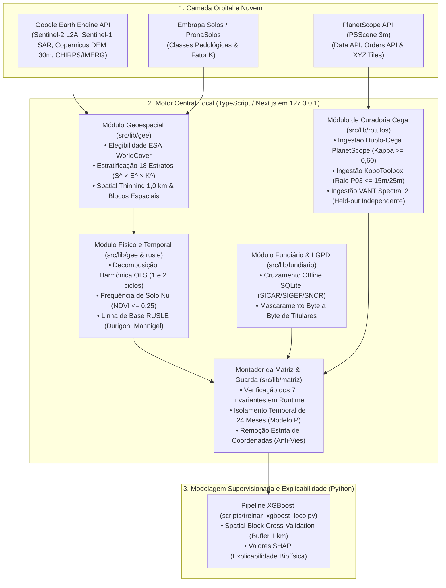

# Ficha Técnica do Sistema — SAREL v2.0

**SAREL — Sistema de Amostragem e Rotulagem para Erosão Laminar**  
*Programa de Pós-Graduação em Tecnologias Computacionais para o Agronegócio (PPGTCA — 2026)*  
*Universidade Tecnológica Federal do Paraná (UTFPR) — Campus Medianeira*

---

## 1. Identificação Geral do Software

| Atributo | Especificação |
| :--- | :--- |
| **Nome Completo** | Sistema de Amostragem e Rotulagem para Erosão Laminar |
| **Sigla / Identificador** | `SAREL` (`sarel` v2.0.0) |
| **Finalidade Científica** | Amostragem estratificada geoespacial, harmonização multitemporal de séries orbitais, cálculo da linha de base física (RUSLE), curadoria cega de rótulos (PlanetScope, Campo e VANT Multiespectral) e montagem auditável de matrizes de treinamento para predição de erosão laminar com *Gradient Boosting* (`XGBoost`) e explicabilidade física (`SHAP`). |
| **Pesquisador Responsável** | Luis Alfredo |
| **Recorte Geográfico Principal** | Bacia Hidrográfica do Paraná 3 (BP3) — Oeste do Estado do Paraná, Brasil |
| **Arquitetura de Implantação** | Estação de trabalho científica *Local-First* / *Edge-Cloud Hybrid* (execução estrita em `127.0.0.1:3000` integrada ao processamento em nuvem no Google Earth Engine) |
| **Classificação Tecnológica** | Sistema de Informação Geográfica (SIG) Científico, Engenharia de Dados Geoespaciais e Plataforma de Curadoria para Aprendizado de Máquina Supervisionado |
| **Preservação e Versionamento** | Repositório Git com congelamento histórico de legado (`tag: legado-pre-sarel`) e trilha de auditoria científica versionada (`sarel/v2`) |

---

## 2. Linguagens de Programação, Consulta e Marcação

O projeto **SAREL** adota uma arquitetura poliglota rigorosamente segregada por responsabilidade computacional, unindo a segurança de tipos algébricos no motor central (TypeScript) à maturidade dos pacotes de aprendizado de máquina e geoprocessamento vetorial (Python e SQL).

### 2.1. TypeScript (`v5.6.3` — Padrão `ES2022`, Modo `strict: true`)
* **Papel no Sistema:** Linguagem principal do núcleo computacional do SAREL (`src/`), englobando tanto o *backend* local (rotas de API Next.js, comunicação com Google Earth Engine, Planet API, Embrapa e auditoria) quanto os motores matemáticos determinísticos e a interface cartográfica interativa.
* **Onde é Aplicada:**
  * **Motor de Amostragem e Geoestatística (`src/lib/gee/`):** Estratificação ortogonal em 18 estratos ($\hat{S} \times \hat{E} \times \hat{K}$), *Spatial Thinning* geodésico de Fisher-Yates (1,0 km), cálculo de semivariograma empírico e particionamento em blocos espaciais (*Spatial Block CV*).
  * **Séries Temporais e Física do Solo (`src/lib/gee/`, `src/lib/rusle/`, `src/lib/chuva/`):** Decomposição harmônica por Mínimos Quadrados Ordinários (OLS de 1 e 2 ciclos anuais — modelo CCDC), frequência de solo nu ($\text{NDVI} \le 0{,}25$), cálculo da equação RUSLE ($A = R \cdot K \cdot LS \cdot C \cdot P$) e acoplamento chuva-solo exposto (Modelo G2).
  * **Garantias Formais e Proveniência (`src/types/`, `src/lib/matriz/`, `src/lib/seguranca/`):** Implementação do tipo genérico `Proveniencia<T>` (selos `medido`, `modelado`, `tabelado`, `indisponivel`), validação dos 7 Invariantes da Matriz de Treino e bloqueio contra dados sintéticos ou vazamento temporal (*data leakage*).

### 2.2. Python (`v3.10+`)
* **Papel no Sistema:** Linguagem dedicada ao pipeline de Aprendizado de Máquina Supervisionado (*offline*), engenharia de dados cadastrais/fundiários massivos (ETL) e geração programática de documentação e relatórios científicos.
* **Onde é Aplicada (`scripts/`):**
  * **Treinamento e Validação Espacial (`treinar_xgboost_loco.py`):** Treinamento de árvores impulsionadas por gradiente (`XGBoost`) sob validação cruzada espacial *Leave-One-Cluster-Out* (LOCO / *Spatial Block*), otimização com regularização $L_1/L_2$ e cálculo de valores `SHAP` para explicabilidade biofísica.
  * **Ingestão Fundiária e Topográfica (`ingest_sicar_official.py`, `ingest_sigef_official.py`, `ingest_sncr_official.py`, `reduzir_terreno_copernicus.py`, `spatial_owner_matcher.py`):** Leitura de *Shapefiles* oficiais do INCRA/SICAR, indexação espacial e redução de modelos digitais de elevação Copernicus DEM GLO-30.
  * **Geração Automatizada de Documentos (`gerar_*_pdf.py`, `gerar_apresentacao_pptx.py`, `gerar_resumo_expandido_docx.py`, `render_formulas.py`):** Compilação automatizada de manuais metodológicos, dossiês periciais em PDF, apresentações em PowerPoint e renderização tipográfica de equações matemáticas.

### 2.3. SQL (`SQLite 3` com Índice Espacial `R*Tree`)
* **Papel no Sistema:** Linguagem de consulta estruturada utilizada no banco de dados relacional/espacial embarcado (`data/fundiario_brasil.db`, ~1,6 GB, consolidando 4,4 milhões de registros oficiais de PR, SC e SP).
* **Onde é Aplicada:** Consultas de intersecção de caixas delimitadoras (*Bounding Box* via tabelas virtuais `R*Tree`) e cruzamento instantâneo offline entre coordenadas de pontos amostrais e malhas fundiárias oficiais (SICAR, SIGEF/INCRA e SNCR), complementadas pela leitura geométrica exata de vértices (`.shp`/`.shx` em `data/sicar_cache/`), garantindo soberania local dos dados sensíveis e conformidade com a LGPD.

### 2.4. C# / .NET Framework (`Instalador_SAREL.exe`) e PowerShell (`.ps1`)
* **Papel no Sistema:** Construção do **Instalador Executável Autônomo de Arquivo Único (`Instalador_SAREL.exe`, ~2,0 MB)** compilado nativamente com `csc.exe` (`scripts/installer/InstaladorSAREL.cs` e `scripts/build_single_exe.py`).
* **Funcionalidades de Implantação:** Embute todo o código do sistema em um recurso compactado (`SarelPayload.zip`), permitindo instalar o SAREL em máquinas sem acesso ao GitHub, criando atalhos na Área de Trabalho/Menu Iniciar (`scripts/install_shortcut.ps1`) e integrando o assistente pós-instalação que recomenda e baixa automaticamente os bancos de dados complementares a partir do diretório oficial no Google Drive (`https://drive.google.com/drive/folders/1S6UsUYGM3dUh7w_hLrmvcsuh0nSfjyYR?usp=sharing`).

### 2.5. JavaScript / ECMAScript Modules (`ES2022` / `.mjs`)
* **Papel no Sistema:** Scripts utilitários de infraestrutura de compilação, verificação de integridade de *build* (`scripts/check-build-freshness.mjs`) e arquivos de configuração de empacotamento (`next.config.mjs`, `postcss.config.mjs`).

### 2.6. HTML5, CSS3 e Tailwind CSS (`v3.4.14`)
* **Papel no Sistema:** Construção da interface visual de alta densidade analítica, renderização de gráficos vetoriais (`SVG`) de séries temporais com envelopes harmônicos, cartografia WebGL (`Canvas`) e estilização responsiva de modais de auditoria e dossiês.

### 2.7. Formatos de Serialização e Intercâmbio Geoespacial
* **JSON / GeoJSON:** Persistência do livro-razão de cotas PlanetScope (`livroRazao.json`), catálogo de sítios padrão-ouro (`sitios_padrao_ouro.json`), contratos de API e malhas vetoriais de bacias e propriedades.
* **KML / KMZ:** Importação de polígonos de Área de Interesse (AOI) via conversão automática para GeoJSON (`@tmcw/togeojson`).
* **CSV / TSV e OpenXML (`.xlsx`):** Exportação de matrizes de treino e planilhas operacionais segmentadas por perfil de cegamento (`planilha`, `interpretacao-cega`, `campo-cego`, `voo-cego`, `matriz-treino`).

---

## 3. Frameworks, Bibliotecas e Dependências

### 3.1. Ecossistema Node.js / TypeScript (`package.json`)

| Categoria | Biblioteca / Pacote | Versão | Função Técnica no SAREL |
| :--- | :--- | :--- | :--- |
| **Framework Full-Stack** | `next` (App Router) | `^14.2.35` | Servidor de aplicação React e rotas de API REST locais (`src/app/api/*`). |
| **Biblioteca de UI** | `react` / `react-dom` | `^18.3.1` | Renderização declarativa de componentes, painéis de campanha e inspetores de ponto. |
| **Gerência de Estado** | `zustand` | `^5.0.1` | Estado global reativo (`useSarelStore`), controle de pontos amostrais, filtros e sessão. |
| **Validação de Esquemas** | `zod` | `^3.23.8` | Validação estrita em tempo de execução para entradas de API, contratos Jev e configurações. |
| **Processamento Orbital** | `@google/earthengine` | `^1.7.41` | SDK oficial do Google Earth Engine para redução zonal de imagens Sentinel-2, Sentinel-1, DEM e CHIRPS. |
| **Motor Cartográfico** | `maplibre-gl` | `^4.7.1` | Renderização acelerada por hardware (WebGL) de mapas, blocos espaciais, tiles Planet e polígonos. |
| **Conversão Vetorial** | `@tmcw/togeojson` | `^5.8.1` | Conversão de arquivos KML/KMZ em geometrias GeoJSON padronizadas (SIRGAS 2000 / WGS84). |
| **Processamento Tabular** | `papaparse` | `^5.4.1` | Parsing e serialização rápida de arquivos CSV de fichas de campo (KoboToolbox) e laudos. |
| **Empacotamento e Laudos** | `jszip` / `jspdf` | `^3.10.1` / `^4.2.1` | Geração de pacotes de reprodutibilidade científica (`.zip`) e exportação de dossiês em PDF. |
| **Estilização e Ícones** | `tailwindcss` / `lucide-react` | `^3.4.14` / `^0.454.0` | Sistema de design utilitário, temas de severidade erosiva e iconografia técnica. |
| **Testes Automatizados** | `vitest` | `^4.1.11` | Executor de testes unitários, testes de invariantes e suíte de integração (`*.test.ts`). |

### 3.2. Ecossistema Científico Python (`scripts/`)

| Categoria | Biblioteca / Pacote | Função Técnica no SAREL |
| :--- | :--- | :--- |
| **Gradient Boosting** | `xgboost` | Treinamento supervisionado dos Modelos D (Detecção) e P (Prognóstico com guarda de 24 meses). |
| **Explicabilidade (XAI)** | `shap` | Cálculo de valores de Shapley (*TreeExplainer*) para atribuição de contribuição física por preditor. |
| **Métricas e Validação** | `scikit-learn` | Cálculo de ROC-AUC, PR-AUC, F1-Score, matriz de confusão e particionamento de validação cruzada. |
| **Álgebra e Tabelas** | `numpy` / `pandas` | Manipulação matricial de atributos biofísicos, séries temporais e higienização pós-exportação. |
| **Geoprocessamento Vetorial** | `pyshp` (`shapefile`) / `sqlite3` | Leitura de malhas oficiais `.shp` (SICAR/SIGEF/SNCR) e persistência indexada em SQLite. |
| **Visualização Científica** | `matplotlib` / `seaborn` / `Pillow` | Geração de gráficos de importância SHAP, curvas ROC/PR e renderização de fórmulas matemáticas. |
| **Engenharia Documental** | `reportlab` / `python-docx` / `python-pptx` | Geração programática de relatórios PDF paginados, artigos DOCX e apresentações PPTX. |

---

## 4. Arquitetura em Camadas e Fluxo de Dados



---

## 5. Estrutura Modular do Código-Fonte (`src/` e `scripts/`)

| Diretório / Módulo | Responsabilidade Técnica e Arquivos-Chave |
| :--- | :--- |
| [`src/app/api/`](file:///c:/Users/lalfr/Docs%20Fora%20do%20Ar/LUIS%20ALFREDO/01%20-%20MESTRADO%20PPGTCA%202026/02%20-%20PESQUISA%20EROS%C3%83O%20LAMINAR/geolocalizacao-erosao-propriedade/src/app/api) | Endpoints locais RESTful para sessão GEE (`auth/gee-session`), seleção de candidatos (`gee/select-candidates`), consulta pedológica (`embrapa/solo`), cruzamento fundiário (`fundiario/consulta`) e auditoria cognitiva (`jev/auditar`). |
| [`src/lib/gee/`](file:///c:/Users/lalfr/Docs%20Fora%20do%20Ar/LUIS%20ALFREDO/01%20-%20MESTRADO%20PPGTCA%202026/02%20-%20PESQUISA%20EROS%C3%83O%20LAMINAR/geolocalizacao-erosao-propriedade/src/lib/gee) | Motores de amostragem biofísica (`amostragemBiofisica.ts`), subdivisão de AOI (`aoiTiling.ts`), estratificação 3D (`estratificacao.ts`), rarefação geodésica (`thinning.ts`), blocos espaciais (`blocosEspaciais.ts`), regressão harmônica OLS (`harmonicos.ts`) e persistência de solo nu (`persistenciaTemporal.ts`). |
| [`src/lib/rusle/`](file:///c:/Users/lalfr/Docs%20Fora%20do%20Ar/LUIS%20ALFREDO/01%20-%20MESTRADO%20PPGTCA%202026/02%20-%20PESQUISA%20EROS%C3%83O%20LAMINAR/geolocalizacao-erosao-propriedade/src/lib/rusle) | Cálculo determinístico da RUSLE (`linhaDeBase.ts`), Fator C tropical por Durigon et al. (`fatorC.ts`) e conversão oficial de classes pedológicas para Fator K numérico segundo a Tabela 5 da Embrapa Solos Doc. 246 (`fatorK.ts`). |
| [`src/lib/chuva/`](file:///c:/Users/lalfr/Docs%20Fora%20do%20Ar/LUIS%20ALFREDO/01%20-%20MESTRADO%20PPGTCA%202026/02%20-%20PESQUISA%20EROS%C3%83O%20LAMINAR/geolocalizacao-erosao-propriedade/src/lib/chuva) | Extração de séries pluviométricas CHIRPS (`chirps.ts`) e GPM IMERG (`imerg.ts`), detecção de eventos extremos erosivos e cálculo do índice dinâmico de acoplamento chuva-solo exposto (`eventos.ts`). |
| [`src/lib/planet/`](file:///c:/Users/lalfr/Docs%20Fora%20do%20Ar/LUIS%20ALFREDO/01%20-%20MESTRADO%20PPGTCA%202026/02%20-%20PESQUISA%20EROS%C3%83O%20LAMINAR/geolocalizacao-erosao-propriedade/src/lib/planet) | Integração com Planet Data/Orders API (`dataApi.ts`, `ordersApi.ts`), pareamento de cenas pré e pós-chuva $T_-, T_0, T_+$ (`paresEvento.ts`) e livro-razão persistente de cotas com trava anti-sobretaxa (`quota.ts`). |
| [`src/lib/rotulos/`](file:///c:/Users/lalfr/Docs%20Fora%20do%20Ar/LUIS%20ALFREDO/01%20-%20MESTRADO%20PPGTCA%202026/02%20-%20PESQUISA%20EROS%C3%83O%20LAMINAR/geolocalizacao-erosao-propriedade/src/lib/rotulos) | Cálculo de concordância inter-intérpretes via Kappa de Cohen (`concordancia.ts`), ingestão de laudos fotográficos e KoboToolbox (`ingestaoKobo.ts`, `ingestaoInterpretacao.ts`) e ingestão segregada de ortomosaicos de drone (`ingestaoDrone.ts`). |
| [`src/lib/matriz/`](file:///c:/Users/lalfr/Docs%20Fora%20do%20Ar/LUIS%20ALFREDO/01%20-%20MESTRADO%20PPGTCA%202026/02%20-%20PESQUISA%20EROS%C3%83O%20LAMINAR/geolocalizacao-erosao-propriedade/src/lib/matriz) | Montagem das matrizes de Detecção (Modelo D) e Prognóstico (Modelo P) (`montagem.ts`, `montagemTemporal.ts`), perfis de cegamento (`perfis.ts`) e fiscalização em tempo de execução dos 7 Invariantes (`invariantes.ts`). |
| [`src/lib/fundiario/`](file:///c:/Users/lalfr/Docs%20Fora%20do%20Ar/LUIS%20ALFREDO/01%20-%20MESTRADO%20PPGTCA%202026/02%20-%20PESQUISA%20EROS%C3%83O%20LAMINAR/geolocalizacao-erosao-propriedade/src/lib/fundiario) | Pareamento espacial com imóveis rurais (`matcher.ts`) e anonimização criptográfica/mascaramento compatível com a LGPD (`protecao.ts`). |
| [`src/lib/seguranca/`](file:///c:/Users/lalfr/Docs%20Fora%20do%20Ar/LUIS%20ALFREDO/01%20-%20MESTRADO%20PPGTCA%202026/02%20-%20PESQUISA%20EROS%C3%83O%20LAMINAR/geolocalizacao-erosao-propriedade/src/lib/seguranca) | Guardas arquiteturais contra pontos sintéticos (`guardaSintetico.ts`), restrição de loopback local (`localOnly.ts`), sessões efêmeras de credenciais em RAM (`sessaoEfemera.ts`) e varredura estática de padrões proibidos (`padroesProibidos.test.ts`). |
| [`src/lib/export/`](file:///c:/Users/lalfr/Docs%20Fora%20do%20Ar/LUIS%20ALFREDO/01%20-%20MESTRADO%20PPGTCA%202026/02%20-%20PESQUISA%20EROS%C3%83O%20LAMINAR/geolocalizacao-erosao-propriedade/src/lib/export) | Conversão geodésica Decimal/DMS (`dms.ts`), geração de planilhas nativas `.xlsx` (`xlsxWriter.ts`) e montagem do pacote de reprodutibilidade científica com manifesto SHA-256 (`pacoteReprodutibilidade.ts`). |

---

## 6. Sensores e Fontes de Dados Geoespaciais Integradas

| Fonte / Sensor | Resolução Espacial / Temporal | Variáveis Extraídas e Papel no Sistema |
| :--- | :--- | :--- |
| **Sentinel-2 MSI (Level-2A)** | 10 m e 20 m / 5 dias (2016–2026) | Reflectância de superfície (B2, B4, B8, B11, B12), máscara de nuvens/sombras (SCL/QA60), séries multitemporais de NDVI e BSI, decomposição harmônica OLS e frequência de solo nu ($\hat{E}$). |
| **Sentinel-1 SAR (GRD Banda C)** | 10 m / 6–12 dias | Retroespalhamento radar ($\sigma^0$ VV, VH e razão VH/VV) para monitoramento da rugosidade superficial e umidade em janelas chuvosas sob cobertura de nuvens. |
| **PlanetScope SuperDove (PSScene)** | 3,0 m / Diária | Recortes de alta resolução em tríades temporais ($T_-$, $T_0$, $T_+$) em torno de eventos erosivos para fotointerpretação humana duplo-cega (Fase A). |
| **VANT Multiespectral Spectral 2** | 3,0 a 7,5 cm (GSD) / Sob demanda | Sensor de 5 bandas calibradas (Azul 475 nm, Verde 560 nm, Vermelho 668 nm, RedEdge 717 nm, NIR 842 nm) + DLS + PPK/RTK. Verdade de campo sub-pixel (*held-out* de validação — Fase D). |
| **Copernicus DEM GLO-30** | 30 m / Estático | Elevação altimétrica, declividade percentual ($\hat{S}$), orientação de vertentes (aspecto) e cálculo topográfico. |
| **CHIRPS & NASA GPM IMERG** | ~5,5 km a 10 km / Diária e 30 min | Precipitação acumulada, identificação de tormentas críticas e cálculo do índice dinâmico chuva-solo exposto (Modelo G2). |
| **ESA WorldCover (v200)** | 10 m / Anual | Máscara de elegibilidade agrícola (classes 30, 40 e 60) e buffers de exclusão hidrografia/áreas urbanas. |
| **Embrapa Solos / PronaSolos** | Vetorial / Multiescala | Classificação pedológica SiBCS e conversão parametrizada para erodibilidade numérica (Fator $K$ — Doc. 246/2024). |
| **SICAR, SIGEF e SNCR** | Vetorial Cadastral | Malha fundiária oficial para localização de imóveis rurais, validação de acesso em campo e conformidade legal. |

---

## 7. Governança Científica, Segurança e Qualidade de Software

### 7.1. As 9 Regras Invioláveis da Lei Fundamental do SAREL
1. **Sem Valores Fabricados:** Dados ausentes ou falhas de sensor permanecem estritamente como `indisponivel` com motivo técnico explícito.
2. **Sem Cortes Silenciosos:** Proibição de *clamping* arbitrário (`Math.max`/`Math.min`) que oculte anomalias radiométricas; valores fora da faixa física recebem selo `fora-do-dominio`.
3. **Rastreabilidade por Proveniência (`Proveniencia<T>`):** Toda variável numérica carrega metadados imutáveis de origem (`● medido`, `◊ modelado`, `□ tabelado`, `○ indisponível`).
4. **Nada Calculado Vira Rótulo:** Índices espectrais, equação RUSLE ou auditoria de IA (`Jev`) **jamais** são convertidos em gabarito ($Y$). Rótulos provêm exclusivamente de observação humana primária (Campo, Fotointerpretação Cega ou Ortomosaico de Drone).
5. **Guarda Antissintética Universal:** Bloqueio em nível de código e testes contra qualquer amostra marcada com `origemSintetica: true`.
6. **Segregação Cega de Exportação:** Coordenadas geográficas (`latitude`, `longitude`), códigos de propriedade e nomes de titulares são fisicamente excluídos da matriz de treino (`matriz-treino`), impedindo que o `XGBoost` memorize localização espúria.
7. **Preservação de Máscaras:** Lacunas por nuvens ou sombras em séries orbitais não sofrem interpolação sintética silenciosa.
8. **Evidência de Verificação:** Nenhuma regra metodológica é dada como cumprida sem teste automatizado correspondente.
9. **Preservação Histórica:** Versionamento auditável e reprodutibilidade por manifesto de decisões (`D01` a `D15`) e parâmetros (`P01` a `P07`).

### 7.2. Os 7 Invariantes de Exportação da Matriz de Treino
Antes de liberar qualquer arquivo `.csv` ou `.xlsx` para treinamento do modelo, o módulo [`src/lib/matriz/invariantes.ts`](file:///c:/Users/lalfr/Docs%20Fora%20do%20Ar/LUIS%20ALFREDO/01%20-%20MESTRADO%20PPGTCA%202026/02%20-%20PESQUISA%20EROS%C3%83O%20LAMINAR/geolocalizacao-erosao-propriedade/src/lib/matriz/invariantes.ts) executa sete verificações bloqueantes:
* **Invariante 1:** Integridade matemática da RUSLE (cálculo de $A$ permitido apenas quando os 5 fatores possuem valores numéricos válidos).
* **Invariante 2:** Ausência absoluta de variáveis de gabarito ou componentes circulares da RUSLE como preditores ($X$) sem declaração formal.
* **Invariante 3:** Concordância inter-intérpretes mínima obrigatória ($\kappa \ge 0{,}60$) para validação de rótulos de fotointerpretação.
* **Invariante 4:** Isolamento estrito das amostras de VANT/Drone (`fase-d-drone`) como conjunto de teste independente (*held-out*), proibindo sua mistura nas dobras de treino.
* **Invariante 5:** Aplicação da janela de guarda temporal de 24 meses antes de $t_0$ para o Modelo P (Prognóstico), prevenindo vazamento temporal (*data leakage*).
* **Invariante 6:** Presença obrigatória do identificador de bloco espacial (`idBlocoEspacial`) para validação cruzada espacial e ausência de coordenadas geográficas na matriz de treino.
* **Invariante 7:** Proibição de valores `NaN`, `Infinity` ou strings vazias disfarçadas nas colunas numéricas exportadas.

### 7.3. Proteção de Dados Pessoais (LGPD) e Segurança Operacional
* **Binding Estrito de Loopback:** O servidor Next.js opera exclusivamente vinculado à interface local `127.0.0.1`, impedindo exposição na rede local ou internet.
* **Sessão Efêmera em Memória (RAM):** Chaves privadas de contas de serviço GCP/GEE e tokens PlanetScope/Jev residem apenas em memória volátil durante a execução ou em cofre local ignorado pelo controle de versão.
* **Mascaramento Determinístico Byte a Byte:** Dados pessoais de titulares rurais (CPF/CNPJ e nomes em bases SNCR/SICAR) são mascarados na camada de apresentação e removidos nos perfis de exportação científica.

---

## 8. Requisitos de Ambiente e Comandos de Verificação

### 8.1. Requisitos de Software e Hardware
* **Sistema Operacional:** Windows 10/11 (64-bit), Linux ou macOS.
* **Runtime JavaScript:** Node.js $\ge 18.17.0$ (recomendado Node.js 20 LTS) e `npm`.
* **Ambiente Python (para pipeline ML e scripts ETL):** Python $\ge 3.10$ com `xgboost`, `shap`, `scikit-learn`, `pandas`, `numpy`, `matplotlib`, `reportlab`.
* **Memória RAM Recomendada:** $\ge 8\text{ GB}$ (16 GB recomendados para cruzamento fundiário SQLite e treinamento local com SHAP).

### 8.2. Disciplina de Verificação ("Os Três Verdes")
O ciclo de vida do software exige aprovação simultânea nas três ferramentas de verificação estática e dinâmica antes de qualquer homologação científica:

```bash
# 1. Execução da suíte completa de testes unitários e invariantes científicos (Vitest)
npm run test

# 2. Verificação estrita de tipos algébricos e contratos de dados (TypeScript)
npm run typecheck

# 3. Auditoria de qualidade de código e padrões arquiteturais (ESLint)
npm run lint

# 4. Compilação de produção e checagem de frescor do build
npm run build
```
