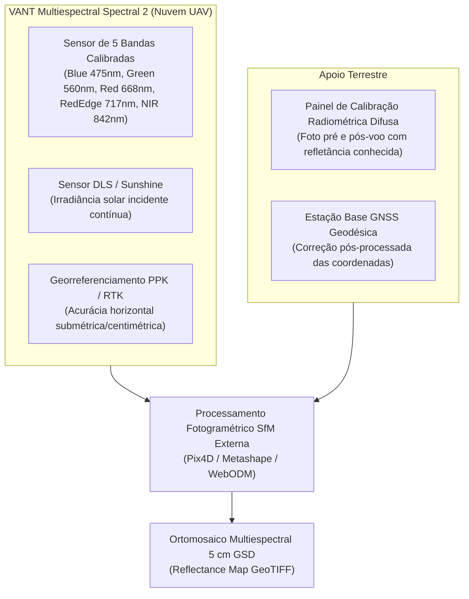

# Ingestão e Processamento dos Dados do VANT Multiespectral Spectral 2 (Nuvem UAV)

**Programa de Pós-Graduação em Tecnologias Computacionais para o Agronegócio (PPGTCA / UEL-UEM-UFPR)**  
**Projeto de Dissertação:** Sistema Automatizado de Reconhecimento de Risco de Erosão Laminar (SAREL)  
**Data:** 23 de Setembro de 2026  
**Status:** Metodologia Formalizada e Aprovada (Decisão Arquitetural D16)

---

## 1. O Paradigma Operacional: Imagens Brutas vs. Ortomosaico de Refletância

Uma questão central para a viabilidade operacional e o rigor científico da pesquisa é o formato em que as imagens capturadas pelo Veículo Aéreo Não Tripulado (VANT) entram na plataforma.

> [!IMPORTANT]
> **Definição Metodológica Mandatória:**  
> A plataforma **SAREL não realiza o processamento fotogramétrico de imagens aéreas brutas isoladas**.  
> O sistema consome exclusivamente o **Ortomosaico Multiespectral Georreferenciado e Calibrado Radiometricamente (GeoTIFF de 5 bandas)**, gerado previamente por software especializado de fotogrametria digital (*Structure from Motion* — SfM).

### Por que não inserir imagens brutas diretamente no SAREL?
1. **Volume e Natureza dos Disparos Brutos:** Um único voo sobre um polígono amostral de 10 a 50 hectares com sobreposição longitudinal e lateral de 75% a 80% gera entre 500 e 2.000 disparos por banda. Com 5 bandas espectrais, trata-se de milhares de arquivos TIFF (10 a 40 GB de dados brutos por levantamento).
2. **Distorções Ópticas e Ângulo de Visada:** Fotos brutas individuais contêm distorção radial e tangencial de lente e perspectiva oblíqua nas bordas do quadro. Não possuem posicionamento geográfico planar ortorretificado de superfície contínua.
3. **Calibração Radiométrica em Bloco:** A conversão de números digitais (*Digital Numbers* — DN) em valores de **Refletância de Superfície** exige a integração das leituras do sensor de incidência de luz solar (DLS) com a fotografia do painel de calibração difusa, calculada simultaneamente em todo o bloco aerotriangulado.

---

## 2. Especificações do VANT e Sensores Embarcados

O levantamento aéreo é executado pelo multirotor profissional **Spectral 2**, fabricado pela empresa brasileira **Nuvem UAV**:

* **Plataforma:** Nuvem UAV Spectral 2 (Hexacóptero / Multirotor de alta estabilidade);
* **Câmara Multiespectral:** Sensor de 5 canais estreitos sincronizados:
  1. *Azul (Blue):* $475\text{ nm} \pm 16\text{ nm}$
  2. *Verde (Green):* $560\text{ nm} \pm 16\text{ nm}$
  3. *Vermelho (Red):* $668\text{ nm} \pm 8\text{ nm}$
  4. *Borda do Vermelho (RedEdge):* $717\text{ nm} \pm 6\text{ nm}$
  5. *Infravermelho Próximo (NIR):* $842\text{ nm} \pm 28\text{ nm}$
* **Resolução Espacial de Voo:** Ground Sample Distance (GSD) de **$3\text{ cm}$ a $7{,}5\text{ cm}$** por pixel (nominal $5\text{ cm}$);
* **Posicionamento Geodésico:** Receptor GNSS integrado de dupla frequência com tecnologia **PPK (Post-Processed Kinematic)** vinculado à base geodésica do IBGE/RBMC;
* **Calibração:** Sensor de luminosidade incidente (DLS) acoplado ao topo da aeronave e painel de calibração radiométrica de refletância difusa fotografado no solo antes e depois de cada missão.

---

## 3. O Fluxo de Processamento Fotogramétrico Externo

Antes de qualquer interação com o código do SAREL, as fotos brutas percorrem o seguinte pipeline fotogramétrico em estações dedicadas:

1. **Ajuste Radiométrico:** Vinculação dos valores do sensor DLS e do painel de calibração para conversão de valores digitais em refletância absoluta ($0{,}0$ a $1{,}0$);
2. **Aerotriangulação e Ajuste de Feixes (Bundle Block Adjustment):** Identificação de pontos homólogos nas fotos sobrepostas e cálculo da orientação interior e exterior dos disparos;
3. **Pós-processamento PPK:** Aplicação dos dados RINEX da estação geodésica de referência aos centros de tomada de cada imagem, alcançando acurácia posicional horizontal inferior a $3\text{ cm}$;
4. **Geração da Nuvem Densa e MDS:** Interpolação estereofotogramétrica da nuvem tridimensional de pontos e geração do Modelo Digital de Superfície (MDS);
5. **Ortorretificação e Mosaicagem:** Projeção diferencial das imagens sobre o relevo, eliminando distorções de relevo e perspectiva.
6. **Exportação do Produto Padronizado:** Arquivo raster em formato **GeoTIFF Multibanda (Float32)** georreferenciado em projeção UTM / SIRGAS 2000.

---

## 4. Ingestão e Processamento no SAREL

Ao ingressar no ecossistema do **SAREL** ([`src/lib/rotulos/ingestaoDrone.ts`](file:///c:/Users/lalfr/Docs%20Fora%20do%20Ar/LUIS%20ALFREDO/01%20-%20MESTRADO%20PPGTCA%202026/02%20-%20PESQUISA%20EROS%C3%83O%20LAMINAR/geolocalizacao-erosao-propriedade/src/lib/rotulos/ingestaoDrone.ts)), o ortomosaico de refletância do Spectral 2 é processado em dois módulos:

### 4.1. Camada de Fotointerpretação Pericial (Padrão-Ouro / Ground Truth)
* O ortomosaico centimétrico é disponibilizado no visualizador geoespacial do SAREL como uma camada raster de altíssima definição (via *Cloud-Optimized GeoTIFF* — COG ou WMS).
* Em virtude do detalhamento de $5\text{ cm}$, o pesquisador e perito agrícola identificam visualmente feições diagnósticas imperceptíveis na resolução de $10\text{ m}$ do Sentinel-2:
  * Microcrostas de selamento superficial e adensamento por impacto de gotas (*splash*);
  * Microrravinamentos incipientes e descontinuidades nas linhas de semeadura;
  * Acúmulo diferencial de sedimentos finos a montante de terraços e linhas de curva de nível;
  * Exposição de horizontes subsuperficiais com descoloração e perda de matéria orgânica.
* O perito atribui o rótulo verdadeiro de validação:
  $$y_{\text{validação}} \in \{0, 1\}$$
  com selo de confiança e registro de metadados periciais.

### 4.2. Extração Zonal Automatizada (Estatística Submétrica por Pixel Orbital)
Para cada pixel orbital de $10\text{ m} \times 10\text{ m}$ do Sentinel-2 contido na área do voo, o SAREL realiza uma agregação zonal (*Zonal Statistics*) sobre os centenas de pixels centimétricos do Spectral 2 contidos naquele quadrante espacial:

$$\text{NDVI}_{\text{médio}}^{\text{drone}} = \frac{1}{K} \sum_{k=1}^K \left( \frac{\text{NIR}_k - \text{Red}_k}{\text{NIR}_k + \text{Red}_k} \right)$$

$$\text{NDRE}_{\text{médio}}^{\text{drone}} = \frac{1}{K} \sum_{k=1}^K \left( \frac{\text{NIR}_k - \text{RedEdge}_k}{\text{NIR}_k + \text{RedEdge}_k} \right)$$

$$\text{FraçãoSoloNu}_{\%}^{\text{drone}} = \frac{1}{K} \sum_{k=1}^K \mathbb{I}(\text{NDVI}_k \le 0{,}25) \times 100$$

onde $K \approx 40.000$ micropixels de $5\text{ cm}$ contidos no interior de uma única célula de $10\text{ m}$ do Sentinel-2.

---

## 5. Por que o Drone NÃO Entra no Treinamento do XGBoost?

Um dos erros metodológicos mais graves em sensoriamento remoto aplicado a aprendizado de máquina é treinar modelos com dados de resolução espacial mista sem isolamento.

> [!CAUTION]
> **Regra Metodológica Inviolável (Decisão D16 & Plano V3, §12.1):**  
> Os dados do VANT multiespectral Spectral 2 são **estritamente HELD-OUT (validação independente e cega)**. É **estruturalmente proibido** incluir qualquer dado ou métrica do drone na matriz de treinamento do modelo regional supervisionado XGBoost.

As razões científicas indispensáveis para essa segregação são:

1. **Incompatibilidade de Escala e Extensão Territorial:** O modelo regional supervisionado é projetado para operar sobre municípios e bacias hidrográficas inteiras no Paraná, utilizando sensores de cobertura sistemática (Sentinel-2, 10 m). O Spectral 2 cobre áreas amostrais restritas (10 a 50 ha). Se o modelo exigisse variáveis do drone no treinamento, ele seria inoperante no restante do estado.
2. **Prevenção de Vazamento de Dados (*Data Leakage*):** O padrão-ouro tem o papel epistemológico de auditar a predição orbital. Se o modelo aprender com os próprios rótulos e assinaturas de alta resolução do drone, o experimento perde a independência estatística, gerando acurácias artificialmente infladas.
3. **Validação Cruzada Cega:** Permite confrontar a predição gerada pelo XGBoost (baseada puramente em dados orbitais, topográficos e de solo) contra a realidade observada a $5\text{ cm}$ no solo pelo Spectral 2.

---

## 6. O Papel do Drone na Validação Científica da Dissertação

O ortomosaico do Spectral 2 atua em **duas frentes de validação rigorosa**:

### A. Auditoria da Acurácia de Classificação do XGBoost
A tabela independente do drone gera a matriz de contingência pericial para a banca examinadora:
* **Matriz de Confusão:** Verdadeiros Positivos (TP), Falsos Positivos (FP), Verdadeiros Negativos (TN), Falsos Negativos (FN);
* **Métricas Corrigidas pelo Acaso:** Coeficiente Kappa de Cohen ($\kappa$), Acurácia Balanceada e Área sob a Curva ROC (AUC-ROC).

### B. Confronto Radiométrico Direto (Pearson $r$)
No módulo [`src/lib/padraoOuro/validacaoMatricial.ts`](file:///c:/Users/lalfr/Docs%20Fora%20do%20Ar/LUIS%20ALFREDO/01%20-%20MESTRADO%20PPGTCA%202026/02%20-%20PESQUISA%20EROS%C3%83O%20LAMINAR/geolocalizacao-erosao-propriedade/src/lib/padraoOuro/validacaoMatricial.ts), calcula-se a correlação linear direta entre o NDVI orbital de $10\text{ m}$ do Sentinel-2 ($x$) e o NDVI centimétrico agregado do Spectral 2 ($y$):

$$r = \frac{\sum_{i=1}^n (x_i - \bar{x})(y_i - \bar{y})}{\sqrt{\sum_{i=1}^n (x_i - \bar{x})^2 \sum_{i=1}^n (y_i - \bar{y})^2}}$$

Esse índice fornece à banca examinadora a prova matemática de que o índice orbital do Sentinel-2 é radiometricamente representativo da verdadeira biomassa vegetal em solo.

---

## 7. Referências Bibliográficas (Normas ABNT)

* CONGALTON, R. G.; GREEN, K. **Assessing the Accuracy of Remotely Sensed Data: Principles and Practices**. 3. ed. Boca Raton: CRC Press, 2019. 348 p.
* NUVEM UAV. **Manual de Operações e Especificações Técnicas: VANT Multiespectral Spectral 2**. São Carlos: Nuvem UAV Indústria de Aeronaves, 2024. 42 p.
* JENSEN, J. R. **Sensoriamento remoto do ambiente: uma perspectiva dos recursos terrestres**. 2. ed. São José dos Campos: Parêntese, 2009. 598 p.
* DEMATTÊ, J. A. M. et al. Bare soil methodology in the Brazilian Cerrado through Landsat and Sentinel-2. **Remote Sensing of Environment**, v. 211, p. 344–366, 2018.
