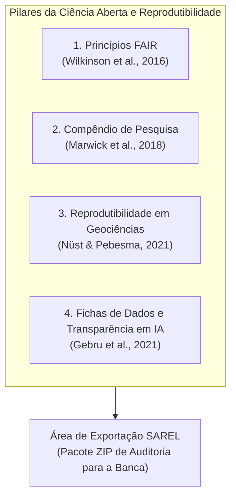

# Área de Exportação do Pacote de Reprodutibilidade da Dissertação (*Research Compendium*)

**Programa de Pós-Graduação em Tecnologias Computacionais para o Agronegócio (PPGTCA / UEL-UEM-UFPR)**  
**Projeto de Dissertação:** Sistema Automatizado de Reconhecimento de Risco de Erosão Laminar (SAREL)  
**Data:** 23 de Setembro de 2026  
**Finalidade:** Especificação Arquitetural da Área de Auditoria, Reprodutibilidade Computacional e Ciência Aberta

---

## 1. Justificativa Epistemológica e Estado da Arte na Literatura

A credibilidade científica de uma dissertação de mestrado e a viabilidade de publicação dos seus achados em periódicos internacionais de alto impacto (*Nature Scientific Data*, *Earth System Science Data*, *Catena*, *Geoderma*) dependem da capacidade de pesquisadores independentes reproduzirem com exatidão os resultados numéricos relatados.

A criação de uma **Área de Exportação do Pacote de Reprodutibilidade** no SAREL apoia-se em **quatro pilares conceituais fundamentais documentados na literatura internacional**:



### Ponto 1: Princípios FAIR para Gestão de Dados Científicos
Publicados em 2016 na *Nature Scientific Data* por um consórcio internacional de cientistas, os **Princípios FAIR** estabelecem que os dados de pesquisa devem ser:
* **F**indable (Localizáveis): dotados de metadados ricos e identificadores únicos persistentes;
* **A**ccessible (Acessíveis): armazenados em formatos abertos e livres de protocolos proprietários;
* **I**nteroperable (Interoperáveis): utilizam esquemas conceituais, vocabulários e tipagens universais;
* **R**eusable (Reutilizáveis): possuem licença clara de uso e rastreabilidade estrita de proveniência (*provenance*).

> **Citação Canônica (ABNT):**  
> WILKINSON, M. D. et al. The FAIR Guiding Principles for scientific data management and stewardship. **Scientific Data**, v. 3, n. 160018, p. 1–9, 2016. DOI: [10.1038/sdata.2016.18](https://doi.org/10.1038/sdata.2016.18).

### Ponto 2: Compêndio de Pesquisa (*Research Compendium*)
Formulado originalmente por Robert Gentleman e Duncan Temple Lang (2007) e consolidado por Marwick et al. (2018) na *The American Statistician*, o conceito de **Compêndio de Pesquisa** prescreve que uma publicação computacional deve ser distribuída como um pacote unificado contendo: **(a)** os dados brutos e derivados, **(b)** o código de análise executável e **(c)** a descrição do ambiente computacional, viabilizando que a conferência científica ocorra de ponta a ponta sem a necessidade de reconstrução manual do pipeline.

> **Citações Canônicas (ABNT):**  
> MARWICK, B. et al. Packaging data analytical work reproducibly using R (and Python) applications. **The American Statistician**, v. 72, n. 1, p. 80–88, 2018. DOI: [10.1080/00031305.2017.1375986](https://doi.org/10.1080/00031305.2017.1375986).  
> GENTLEMAN, R.; TEMPLE LANG, D. Statistical analyses and reproducible research. **Journal of Computational and Graphical Statistics**, v. 16, n. 1, p. 1–23, 2007.

### Ponto 3: Reprodutibilidade Prática em Geociências e Sensoriamento Remoto
No contexto específico das geociências, Roger Peng (2011) na *Science* e Nüst & Pebesma (2021) no *Annals of the American Association of Geographers* demonstraram que experimentos baseados em Sistemas de Informação Geográfica (SIG) sofrem historicamente de "opacidade metodológica" quando os autores publicam apenas mapas estilizados sem expor as matrizes numéricas subjacentes e as divisões espaciais de treino/teste. Os autores sustentam que fornecer scripts reproduzíveis com controle de semente aleatória e matrizes tabulares georreferenciadas é o único padrão aceitável para afastar suspeitas de viés de seleção.

> **Citações Canônicas (ABNT):**  
> NÜST, D.; PEBESMA, E. Practical reproducibility in geography and geosciences. **Annals of the American Association of Geographers**, v. 111, n. 5, p. 1300–1310, 2021. DOI: [10.1080/24694452.2020.1806028](https://doi.org/10.1080/24694452.2020.1806028).  
> PENG, R. D. Reproducible research in computational science. **Science**, v. 334, n. 6060, p. 1226–1227, 2011. DOI: [10.1126/science.1213847](https://doi.org/10.1126/science.1213847).

### Ponto 4: Fichas de Dados e Transparência em Modelos de IA (*Datasheets for Datasets*)
Em modelos preditivos supervisionados complexos (como o XGBoost), Gebru et al. (2021) no *Communications of the ACM* e Mitchell et al. (2019) propuseram as **Fichas de Dados para Conjuntos de Dados (*Datasheets for Datasets*)** e os **Cartões de Modelo (*Model Cards*)**. Esse procedimento documenta formalmente a motivação da coleta, procedimentos de limpeza, variáveis sensíveis excluídas (para evitar vazamento de dados) e as condições ideais e limites de validade da predição.

> **Citações Canônicas (ABNT):**  
> GEBRU, T. et al. Datasheets for datasets. **Communications of the ACM**, v. 64, n. 12, p. 86–92, 2021. DOI: [10.1145/3458723](https://doi.org/10.1145/3458723).  
> MITCHELL, M. et al. Model Cards for Model Reporting. In: **ACM Conference on Fairness, Accountability, and Transparency (FAT* '19)**, 2019, Atlanta. Proceedings [...]. New York: ACM, 2019. p. 220–229.

---

## 2. Arquitetura da Área de Exportação na Plataforma SAREL

A funcionalidade é integrada à interface gráfica do SAREL através do módulo [`src/components/export/ExportModal.tsx`](file:///c:/Users/lalfr/Docs%20Fora%20do%20Ar/LUIS%20ALFREDO/01%20-%20MESTRADO%20PPGTCA%202026/02%20-%20PESQUISA%20EROS%C3%83O%20LAMINAR/geolocalizacao-erosao-propriedade/src/components/export/ExportModal.tsx), acionada por um botão de destaque na barra de ferramentas analítica:

> **[ Gerar Pacote de Reprodutibilidade da Dissertação (.ZIP) ]**

Ao ser disparada, a rotina aplica os filtros de perfil estabelecidos em [`src/lib/matriz/perfis.ts`](file:///c:/Users/lalfr/Docs%20Fora%20do%20Ar/LUIS%20ALFREDO/01%20-%20MESTRADO%20PPGTCA%202026/02%20-%20PESQUISA%20EROS%C3%83O%20LAMINAR/geolocalizacao-erosao-propriedade/src/lib/matriz/perfis.ts) e valida os 7 invariantes numéricos e de segurança ([`src/lib/matriz/invariantes.ts`](file:///c:/Users/lalfr/Docs%20Fora%20do%20Ar/LUIS%20ALFREDO/01%20-%20MESTRADO%20PPGTCA%202026/02%20-%20PESQUISA%20EROS%C3%83O%20LAMINAR/geolocalizacao-erosao-propriedade/src/lib/matriz/invariantes.ts)), compactando automaticamente **6 arquivos padronizados**:

```
PACOTE_REPRODUTIBILIDADE_SAREL_PPGTCA_2026.zip
│
├── 01_matriz_preditores_treinamento_sarel.csv
├── 02_validacao_padrao_ouro_held_out_drone.csv
├── 03_confronto_radiometrico_sentinel_spectral2.csv
├── 04_datasheet_metadados_dicionario.json
├── 05_script_auditoria_reproduzivel.py
└── 06_manifesto_integridade_sha256.txt
```

---

## 3. Especificação Detalhada dos 6 Arquivos Exportados

### Arquivo 01: `01_matriz_preditores_treinamento_sarel.csv`
* **Descrição:** Matriz tabular estruturada de dados biofísicos e geoespaciais alimentadora do modelo supervisionado regional.
* **Conteúdo detalhado:**
  * Identificador e geolocalização: `Ponto_ID`, `Latitude`, `Longitude` (EPSG:4326), `Municipio`, `Codigo_IBGE`;
  * Estruturação espacial: `Bloco_Espacial` (microbacia hidrográfica para agrupamento de validação cruzada espacial);
  * Preditores espectrais Sentinel-2 (GEE): $\text{NDVI}_{\text{p10}}, \text{NDVI}_{\text{p50}}, \text{NDVI}_{\text{p90}}, \text{BSI}_{\text{p50}}$, Frequência de solo exposto ($\hat{E}$), lags temporais ($t_0, t_{-3m}, t_{-6m}, t_{-12m}$), amplitudes harmônicas e tendência linear SWIR;
  * Preditores de terreno (SRTM/ALOS): Elevação ($m$), declividade ($\%$, radianos), curvaturas de perfil e plano, índice topográfico de umidade (TWI) e Fator $LS$;
  * Preditores pedológicos e climáticos: Fator $K$ contínuo da Embrapa (Tabela 5, Doc. 246/2024), Fator $R$ de erosividade e precipitação acumulada;
  * Rótulo-alvo supervisionado: `Rotulo_Classe` ($y \in \{0, 1\}$);
  * Metadados de integridade: Registro da proveniência (`medido` vs `ausente`).

### Arquivo 02: `02_validacao_padrao_ouro_held_out_drone.csv`
* **Descrição:** Conjunto independente de avaliação pericial de alta resolução, mantido estritamente isolado da matriz de treinamento (*held-out* inviolável).
* **Conteúdo detalhado:**
  * `Codigo_Ponto` e coordenadas centimétricas obtidas por VANT com tecnologia PPK/RTK;
  * Metadados da missão aérea: Aeronave **Spectral 2 (Nuvem UAV)**, data de sobrevoo, GSD de $5\text{ cm}$, calibração por sensor DLS e painel de refletância difusa;
  * `Rotulo_Especialista`: Diagnóstico pericial cego ($0 = \text{ausente}$, $1 = \text{laminar confirmada}$);
  * Nível de confiança do perito e notas descritivas de microcrostas e selamento superficial.

### Arquivo 03: `03_confronto_radiometrico_sentinel_spectral2.csv`
* **Descrição:** Pareamento quantitativo pixel-a-pixel entre o sensor orbital e o sensor aéreo multiespectral de alta resolução.
* **Conteúdo detalhado:**
  * `Pixel_ID_10m`: Código da célula de $10\text{ m} \times 10\text{ m}$ da grade orbital do Sentinel-2;
  * `NDVI_Sentinel2`: Refletância e NDVI medido pelo satélite Sentinel-2 na cena contemporânea;
  * `NDVI_Medio_Spectral2`: Média aritmética de todos os micropixels de $5\text{ cm}$ do Spectral 2 contidos no quadrante de $10\text{ m}$;
  * `NDRE_Medio_Spectral2`: Índice RedEdge centimétrico de clorofila;
  * `Fracao_Solo_Nu_Pct`: Porcentagem real de solo mineral desprovido de biomassa;
  * `Residuo`: Diferença linear $(x_i - y_i)$;
  * **Coeficiente de Pearson ($r$):** Valor sumarizado do confronto radiométrico.

### Arquivo 04: `04_datasheet_metadados_dicionario.json`
* **Descrição:** Dicionário de dados interoperável estruturado em JSON com a especificação formal de cada coluna, seguindo as diretrizes de Gebru et al. (2021).
* **Conteúdo detalhado:**
  * Nome canônico de cada atributo, tipo de dado (Float64, Int32, String) e unidade do Sistema Internacional;
  * Limites de domínio físico aceitáveis (ex.: $\text{NDVI} \in [-1{,}0; +1{,}0]$, $\text{Declividade} \ge 0$, $K \in [0{,}0052; 0{,}0518]$);
  * Fontes primárias oficiais dos dados (Sentinel-2 L2A via GEE, Copernicus DEM, Embrapa Solos GeoServer, CHIRPS/INMET, Nuvem UAV);
  * Citações bibliográficas associadas a cada equação (em formato ABNT).

### Arquivo 05: `05_script_auditoria_reproduzivel.py`
* **Descrição:** Script autônomo e executável em Python (dependências universais: `pandas`, `numpy`, `scikit-learn`, `xgboost`).
* **Como a banca examinadora o utiliza:**
  1. O examinador descompacta o arquivo ZIP e digita em seu terminal:
     ```bash
     python 05_script_auditoria_reproduzivel.py
     ```
  2. O script carrega `01_matriz_preditores_treinamento_sarel.csv` com semente pseudoaleatória pré-fixada (`random_state=42`);
  3. Executa o particionamento espacial por blocos (*Spatial Block Bootstrap* / LOCO);
  4. Treina o classificador XGBoost e avalia cegamente contra `02_validacao_padrao_ouro_held_out_drone.csv`;
  5. Imprime no terminal a Matriz de Confusão, Acurácia Balanceada, ROC-AUC, Kappa de Cohen ($\kappa$) e a correlação de Pearson ($r$) do Arquivo 03, **gerando exatamente os mesmos números e tabelas que constam no corpo da dissertação de mestrado**.

### Arquivo 06: `06_manifesto_integridade_sha256.txt`
* **Descrição:** Manifesto de integridade criptográfica com *hashes* SHA-256 gerados no momento da compilação do pacote.
* **Exemplo de conteúdo:**
  ```text
  b4a92c81ef40d927a7... 01_matriz_preditores_treinamento_sarel.csv
  5e1039dc4ba109a28b... 02_validacao_padrao_ouro_held_out_drone.csv
  98cf01aa72e5912401... 03_confronto_radiometrico_sentinel_spectral2.csv
  28d9c12b1a50893012... 04_datasheet_metadados_dicionario.json
  7c32098dca00129fec... 05_script_auditoria_reproduzivel.py
  ```
* **Finalidade:** Permite ao avaliador checar a integridade com o comando `sha256sum -c 06_manifesto_integridade_sha256.txt`, provando matematicamente que nenhuma linha de dado ou linha de código foi editada manualmente após a emissão da versão de defesa.

---

## 4. Benefícios Práticos para a Defesa de Mestrado

1. **Blindagem contra Questionamentos Metodológicos:** Elimina qualquer dúvida sobre manipulação de dados, "cherry-picking" ou sobreajuste de modelos.
2. **Autonomia Completa dos Avaliadores:** A banca não precisa acessar sistemas externos ou instalar dependências complexas; basta executar o script Python padrão.
3. **Prontidão para Periódicos Científicos Internacionais:** O pacote atende aos requisitos de submissão do repositório *Zenodo*, *Mendeley Data* ou *Pangaea*, permitindo a obtenção de um **DOI persistente** para o dataset da dissertação.

---

## 5. Referências Bibliográficas (Normas ABNT)

* GEBRU, T. et al. Datasheets for datasets. **Communications of the ACM**, v. 64, n. 12, p. 86–92, 2021. DOI: [10.1145/3458723](https://doi.org/10.1145/3458723).
* GENTLEMAN, R.; TEMPLE LANG, D. Statistical analyses and reproducible research. **Journal of Computational and Graphical Statistics**, v. 16, n. 1, p. 1–23, 2007.
* MARWICK, B. et al. Packaging data analytical work reproducibly using R (and Python) applications. **The American Statistician**, v. 72, n. 1, p. 80–88, 2018. DOI: [10.1080/00031305.2017.1375986](https://doi.org/10.1080/00031305.2017.1375986).
* MITCHELL, M. et al. Model Cards for Model Reporting. In: **ACM Conference on Fairness, Accountability, and Transparency (FAT* '19)**, 2019, Atlanta. Proceedings [...]. New York: ACM, 2019. p. 220–229.
* NÜST, D.; PEBESMA, E. Practical reproducibility in geography and geosciences. **Annals of the American Association of Geographers**, v. 111, n. 5, p. 1300–1310, 2021. DOI: [10.1080/24694452.2020.1806028](https://doi.org/10.1080/24694452.2020.1806028).
* PENG, R. D. Reproducible research in computational science. **Science**, v. 334, n. 6060, p. 1226–1227, 2011. DOI: [10.1126/science.1213847](https://doi.org/10.1126/science.1213847).
* WILKINSON, M. D. et al. The FAIR Guiding Principles for scientific data management and stewardship. **Scientific Data**, v. 3, n. 160018, p. 1–9, 2016. DOI: [10.1038/sdata.2016.18](https://doi.org/10.1038/sdata.2016.18).
