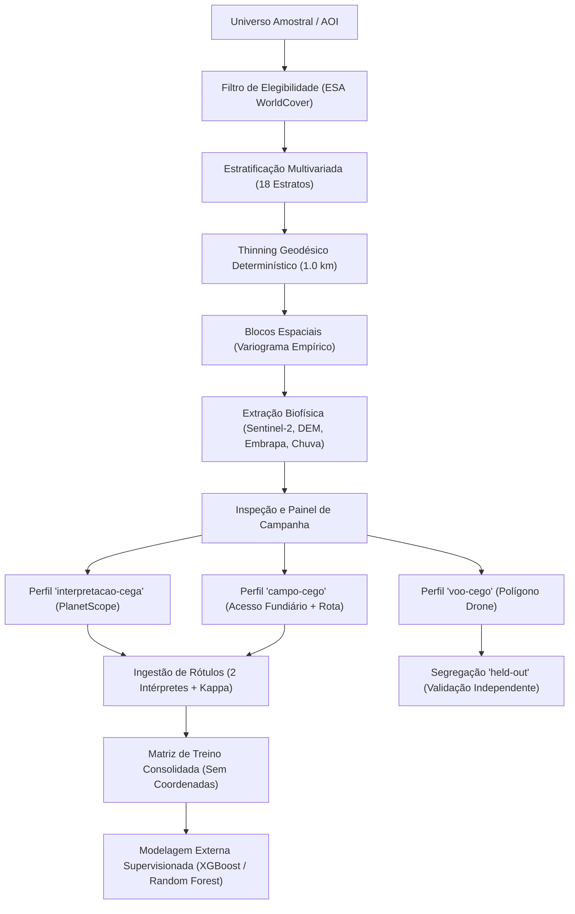

# Documento de Design e Arquitetura — SAREL

**Sistema de Amostragem e Rotulagem para Erosão Laminar**  
**Programa de Pós-Graduação em Tecnologias Computacionais para o Agronegócio (PPGTCA - 2026)**  
*Pesquisa de Mestrado — Estado do Paraná*  
**Versão:** 2.0 (10/09/2026)

---

## 1. Princípios Norteadores e a Lei Fundamental

O SAREL foi projetado para eliminar qualquer risco de viés de modelagem, vazamento de rótulo ou fabricação de parâmetros. Toda a arquitetura do sistema é governada por **9 Regras Invioláveis**:

1. **Regra 1 — Sem Valores Fabricados:** Variáveis sem resposta da fonte permanecem estritamente como `indisponivel` acompanhadas de causa e motivo formal. É terminantemente proibido o uso de números mágicos (`|| 16`, `?? 0.035`) ou preenchimentos arbitrários.
2. **Regra 2 — Sem Cortes Silenciosos:** Proibição de pisos ou limites artificiais (`Math.max`, `Math.min`). Valores fora do domínio físico ou biofísico disparam exceções explícitas ou causam indisponibilidade técnica (`fora-do-dominio`).
3. **Regra 3 — Rastreabilidade e Proveniência:** Todas as grandezas científicas são encapsuladas no tipo discriminado `Proveniencia<T>` (`medido`, `modelado`, `tabelado`, `indisponivel`).
4. **Regra 4 — Nada Calculado Vira Rótulo:** Modelos matemáticos (como RUSLE ou índices empíricos) jamais atuam como gabarito supervisionado. O rótulo da erosão provém unicamente da observação primária humana (campo, fotointerpretação PlanetScope, ortomosaicos de drone).
5. **Regra 5 — Guarda Antissintético Universal:** O sistema valida continuamente e de forma recursiva que nenhum ponto amostral possua a flag `origemSintetica: true`.
6. **Regra 6 — Segregação Cega de Exportação:** As equipes de interpretação, campo e modelagem recebem artefatos estritamente cegos projetados por listas de permissão (Invariante 2). Coordenadas não entram na matriz de treino tabular para evitar que o algoritmo aprenda localização espacial em vez de processo físico.
7. **Regra 7 — Preservação de Máscaras:** Nuvem, sombra de nuvem e dados inválidos de sensoriamento remoto são preservados como máscaras reais e desenhados como descontinuidades nos gráficos temporais.
8. **Regra 8 — Evidência de Verificação:** Comentários com asserções de verificação exigem arquivo físico de prova arquivado em `docs/verificacoes/`.
9. **Regra 9 — Preservação do Histórico:** Mudanças arquiteturais mantêm rastreabilidade Git intacta, com o código histórico isolado na tag `legado-pre-sarel`.

---

## 2. Mapa Conceitual dos Módulos e Cálculos

| Variável / Módulo | Base / Fonte | Fórmula / Método | Decisão Metodológica |
|---|---|---|---|
| **Estratificação** | Copernicus DEM GLO-30, Sentinel-2 L2A, Embrapa | 18 estratos multivariados: $\hat{S}$ (terços declividade) $\times \hat{E}$ (terços exposição) $\times \hat{K}$ (erodibilidade) | D12, P04, P05 |
| **Thinning Espacial** | Geodésia elipsoidal WGS84 | Fisher-Yates determinístico com raio $\ge 1{,}0\text{ km}$ e semente registrada | P02, P07 |
| **Blocos Espaciais** | Coordenadas do desenho amostral | Variograma empírico da distância entre pares; contingência com aresta de 20 km | P01 |
| **Harmônicos Temporais** | Bandas B11, B12, NDVI (Sentinel-2) | OLS multivariado (1 e 2 harmônicos) com métricas $R^2$, SE e guarda para $n < 12$ obs | D11 |
| **Frequência Solo Nu ($\hat{E}$)** | Sentinel-2 L2A | Razão $n_{\text{exposto}} / n_{\text{válido}}$, maior sequência contígua e mês modal | D10 |
| **Pares de Eventos** | PlanetScope (PSScene) e Sentinel-1 | Trios ($T_-, T_0, T_+$) com $\Delta\text{zenital} \le 10^\circ$, $\Delta t \le 20\text{d}$, corte 250m e radar C | D17, D18, D19 |
| **Fator C RUSLE** | NDVI Sentinel-2 L2A | Regional tropical Durigon et al. (2014): $C = (1 - \text{NDVI})/2$; sensibilidade van der Knijff (2000) | D01 |
| **Fator P RUSLE** | Prática conservacionista | Renard et al. (1997): $P = 1{,}0$ tabelado na ausência de observação de manejo | — |
| **Fatores R, K, LS** | CHIRPS, IMERG, Embrapa, MDE | Retidos com causa `"decisao-pendente"` até definição metodológica do pesquisador | D13, D14, D15 |
| **Perda de Solo RUSLE** | Invariante 1 | $A = R \cdot K \cdot LS \cdot C \cdot P$; só existe se os 5 fatores e a memória existirem simultaneamente | Invariante 1 |
| **Concordância Inter-intérpretes**| Fotointerpretação | Kappa de Cohen matricial; alerta bloqueante para $\kappa < 0{,}60$; divergências para desempate | P08 |
| **Conjunto Held-Out** | Voo de drone | Segregação obrigatória e isolamento em arquivo independente; nunca entra no treino | Regra 6 |

---

## 3. Fluxo de Dados e Perfis de Exportação

---

## 4. Invariantes do Sistema

Antes da persistência ou exportação de qualquer tabela, o módulo `src/lib/matriz/invariantes.ts` valida os **Sete Invariantes de Integridade**:
1. **Invariante 1:** Coerência RUSLE: $\text{perdaSolo} \iff 5\text{ fatores presentes} \iff \text{memória de cálculo presente}$.
2. **Invariante 2:** Lista de Permissão Estrita do Perfil de Exportação (bloqueia vazamento de variáveis internas como $\Phi_{\text{diag}}$ ou coordenadas).
3. **Invariante 3:** Derivação exata de `Campos_Estimados` a partir de variáveis com estado diferente de `"medido"`.
4. **Invariante 4:** Rastreabilidade de Satélite: dados orbitais exigem lista de `PRODUCT_ID`, versão do motor e timestamp.
5. **Invariante 5:** Afirmação Negativa Fundiária: declaração de `"sem-correspondencia"` exige histórico de consulta válida sem match geográfico.
6. **Invariante 6:** Proibição de Literais Geográficos Espúrios (`"Custom"`, `"Bacia Local"`, nome de UF no município).
7. **Invariante 7:** Detector de Constante Disfarçada: recusa exportação se qualquer coluna numérica possuir valor idêntico em todas as linhas válidas para $n \ge 21$.
