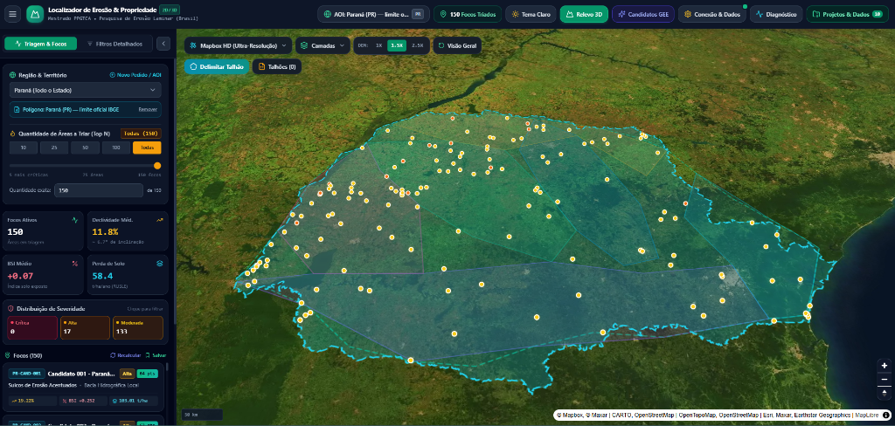
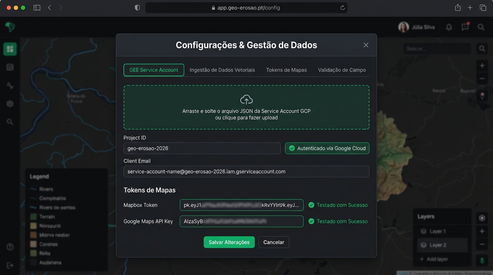
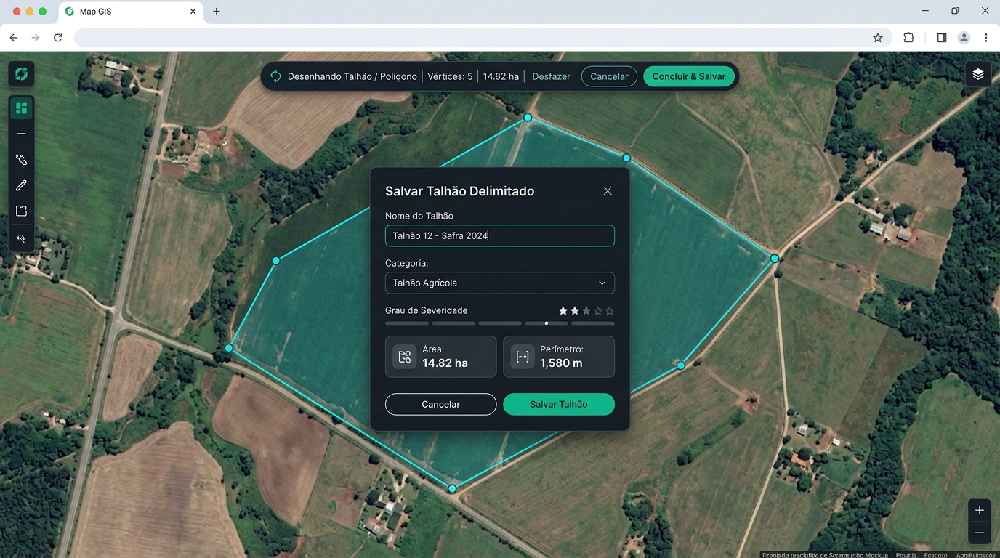
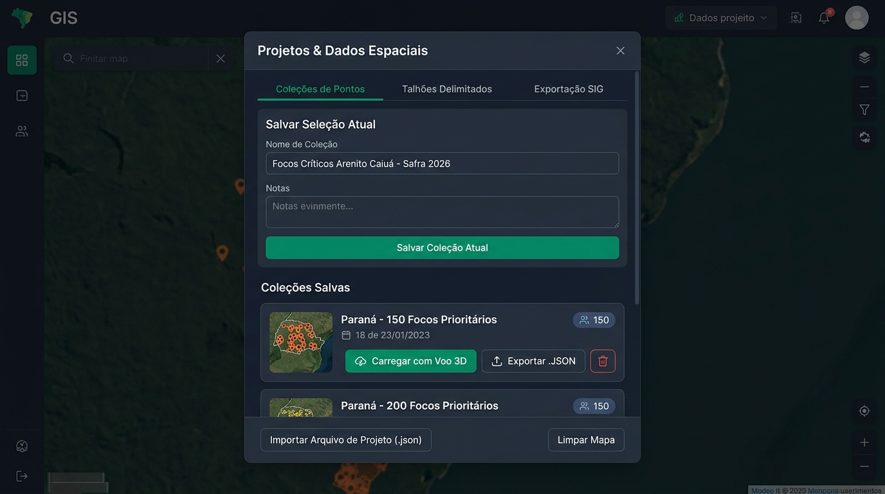
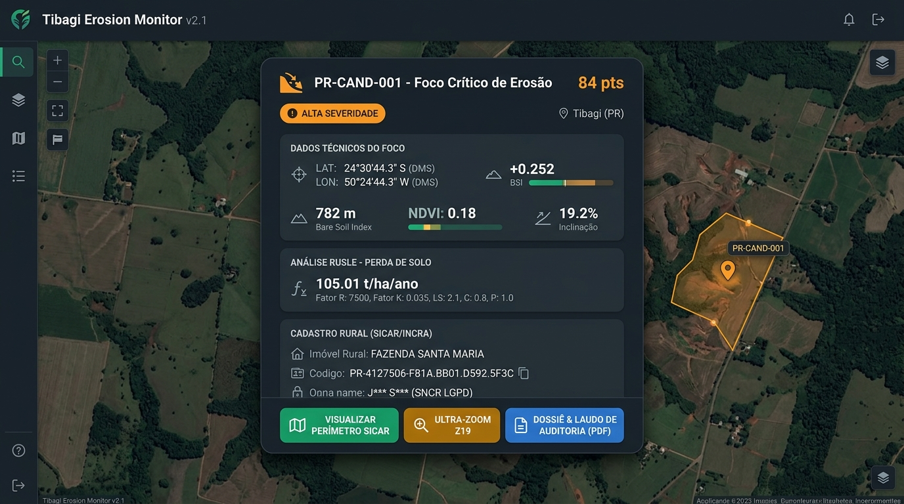
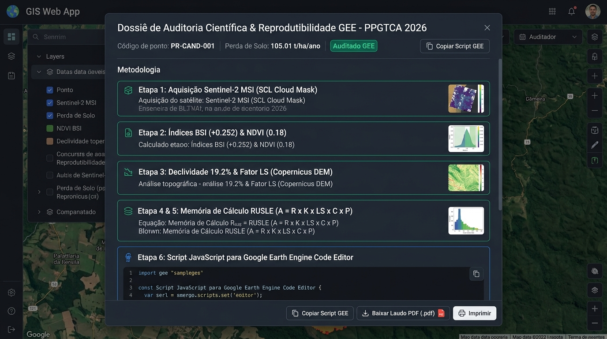
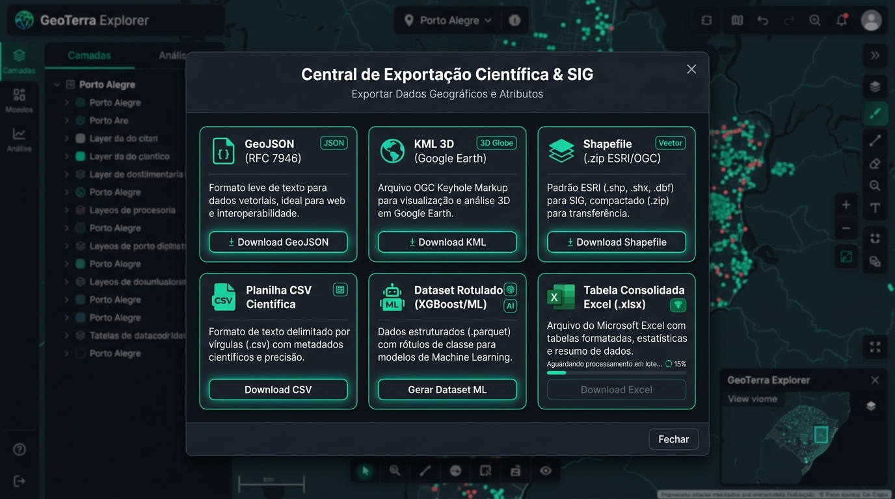
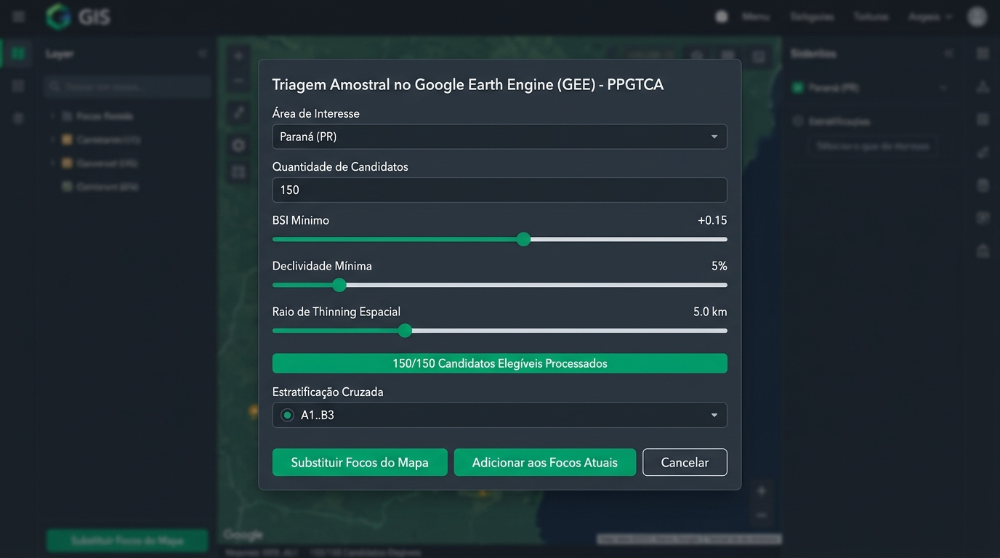
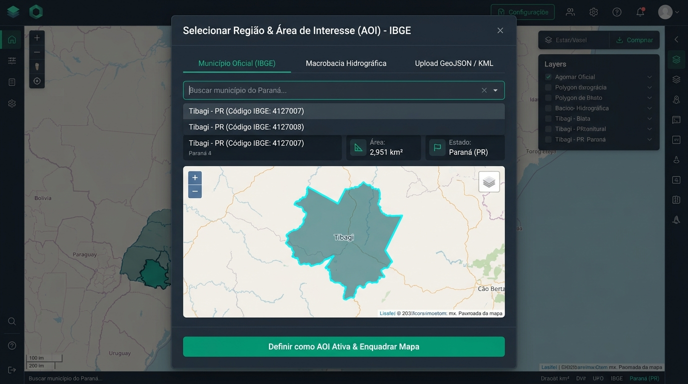

# Documento de Design de Interface & Telas do Sistema (design.md)

### Plataforma Geoespacial de Detecção, Triagem e Priorização de Focos de Erosão Laminar
**Programa de Pós-Graduação em Tecnologias Computacionais para o Agronegócio (PPGTCA - 2026)**  
**Linha de Pesquisa:** Sensoriamento Remoto, Inteligência Geoespacial e Conservação de Solos  
**Área de Aplicação:** Monitoramento de Solos, Cadastro Ambiental Rural e Geoprocessamento 2D/3D (Paraná / Brasil)

---

## Sumário Executivo

1. [Visão Geral & Diretrizes do Design System](#1-visão-geral--diretrizes-do-design-system)
2. [Arquitetura Geral de Navegação e Layout](#2-arquitetura-geral-de-navegação-e-layout)
3. [Catálogo Completo das Telas, Modais e Componentes Visuais](#3-catálogo-completo-das-telas-modais-e-componentes-visuais)
   - [3.1. Tela Principal (Dashboard / Visualizador 2D/3D & Painel Lateral)](#31-tela-principal-dashboard--visualizador-2d3d--painel-lateral)
   - [3.2. Tela de Inserção de Chaves e Credenciais de Nuvem (SettingsModal)](#32-tela-de-inserção-de-chaves-e-credenciais-de-nuvem-settingsmodal)
   - [3.3. Tela de Delimitação e Gestão de Polígonos e Talhões Agrícolas](#33-tela-de-delimitação-e-gestão-de-polígonos-e-talhões-agrícolas)
   - [3.4. Tela de Salvamento, Coleções e Projetos Espaciais (SavedDatasetsModal)](#34-tela-de-salvamento-coleções-e-projetos-espaciais-saveddatasetsmodal)
   - [3.5. Tela do Painel de Inspeção do Ponto de Erosão (PointPopup)](#35-tela-do-painel-de-inspeção-do-ponto-de-erosão-pointpopup)
   - [3.6. Tela do Dossiê de Auditoria Científica & Emissão de Laudo Técnico (AuditDossierModal)](#36-tela-do-dossiê-de-auditoria-científica--emissão-de-laudo-técnico-auditdossiermodal)
   - [3.7. Tela da Central de Exportação de Dados Científicos (ExportModal)](#37-tela-da-central-de-exportação-de-dados-científicos-exportmodal)
   - [3.8. Tela de Triagem e Amostragem de Candidatos no GEE (CandidateSelectionModal)](#38-tela-de-triagem-e-amostragem-de-candidatos-no-gee-candidateselectionmodal)
   - [3.9. Tela de Seleção de Região Territorial & AOI (RegionRequestModal)](#39-tela-de-seleção-de-região-territorial--aoi-regionrequestmodal)
   - [3.10. Tela de Diagnósticos de Integridade e Logs do Sistema (SystemLogsModal)](#310-tela-de-diagnósticos-de-integridade-e-logs-do-sistema-systemlogsmodal)
4.   [Guia de Estilo, Cores e Tipografia](#5-guia-de-estilo-cores-e-tipografia)

---

## 1. Visão Geral & Diretrizes do Design System

A plataforma foi projetada sob uma filosofia de **Engenharia Geoespacial Orientada a Decisões**, unindo a robustez dos Sistemas de Informação Geográfica (SIG/GIS) de alto desempenho à elegância e fluidez de interfaces web modernas em **Next.js 14, React, Tailwind CSS e TypeScript**.

### Princípios Norteadores de UI/UX:
- **Clareza de Métricas Científicas:** Toda informação biofísica (BSI, NDVI, declividade, RUSLE) é apresentada com unidades físicas explícitas, escalas colorimétricas calibradas e rastreabilidade metodológica.
- **Visualização Imersiva 2D / 3D:** Alternância contínua entre visualização ortogonal cartográfica e relevo topográfico tridimensional em tempo real acelerado por GPU (MapLibre GL JS + DEM Terrarium), permitindo analisar vertentes, encostas e ravinas.
- **Segurança e Privacidade em Primeiro Lugar (LGPD):** Credenciais sensíveis de nuvem (Service Accounts) nunca são salvas no `localStorage` nem trafegam abertas; nomes de titulares fundiários respeitam rigorosamente a pseudonimização oficial do SNCR/INCRA conforme a Lei Geral de Proteção de Dados (Lei 13.709/2018).
- **Feedback Visual Contínuo:** Operações de geoprocessamento em lote, consultas espaciais e testes de chaves contam com barras de progresso, estados de carregamento e notificações para uma experiência fluida e sem atritos.

---

## 2. Arquitetura Geral de Navegação e Layout

O layout principal divide o espaço da tela em três módulos sincronizados:

```
┌────────────────────────────────────────────────────────────────────────────────────────────────────────┐
│ BARRA SUPERIOR (HEADER)                                                                                │
│ [Logo PPGTCA] [AOI Ativa: Paraná (PR)] [Focos Triados: 150] [Tema] [Relevo 3D] [GEE] [Conexão] [Projetos]│
├────────────────────────────────┬───────────────────────────────────────────────────────────────────────┤
│                                │ VISUALIZADOR CARTOGRÁFICO 3D (MAPVIEWER)                              │
│ PAINEL LATERAL (SIDEBAR)       │ - Controles Flutuantes: Basemap HD, Seletor de Camadas, Relevo DEM    │
│ - Região Territorial e AOI     │ - Botões de Ação: "Delimitar Talhão", "Talhões (N)"                   │
│ - Seletor Top-N (10 a 150)     │ - Polígonos de Limites IBGE e Bacias Hidrográficas                    │
│ - Indicadores Globais          │ - Camada Heatmap de Concentração de Risco                             │
│ - Distribuição de Severidade   │ - Marcadores Interativos de Focos (Crítico, Alto, Moderado)           │
│ - Lista de Cards com Voo 3D    │ - Perímetros Fundiários Oficiais do SICAR projetados no mapa          │
│ - Recálculo em Lote GEE        │                                                                       │
│                                │ [POINTPOPUP] Painel de Inspeção com RUSLE e Cruzamento CAR/SIGEF/SNCR │
└────────────────────────────────┴───────────────────────────────────────────────────────────────────────┘
```

---

## 3. Catálogo Completo das Telas, Modais e Componentes Visuais

---

### 3.1. Tela Principal (Dashboard / Visualizador 2D/3D & Painel Lateral)

#### Descrição da Interface
A tela de abertura e núcleo de comando do sistema. Combina uma barra de ferramentas superior (*Header*) padronizada, uma barra lateral retrátil à esquerda (*Sidebar*) com filtros avançados e lista de focos de erosão, e uma área de mapa central acelerada por hardware (WebGL). Permite a navegação fluida em três dimensões sobre o território do Paraná ou qualquer município do Brasil.



#### Principais Recursos e Funções da Tela:
1. **Barra Superior (Header Bar):**
   - **Identificação Institucional:** Logotipo com insígnia e subtítulo do Programa de Pós-Graduação em Tecnologias Computacionais para o Agronegócio (PPGTCA - 2026).
   - **Pílula de Região / AOI Ativa:** Exibe o recorte territorial ativo (ex: `AOI: Paraná (PR) — Limite oficial IBGE`). Ao clicar, abre o modal de seleção territorial (`RegionRequestModal`).
   - **Contador de Focos Triados:** Pílula dinâmica indicando a quantidade de ocorrências filtradas versus o total cadastrado (ex: `150 Focos Triados`).
   - **Alternador de Tema (Claro / Escuro):** Alterna a paleta de cores entre o tema escuro de alto contraste (ideal para visualização de sensores orbitais) e o tema claro (ideal para impressões).
   - **Botão Relevo 3D / Modo 2D:** Converte instantaneamente a visualização planar em uma malha altimétrica tridimensional com sombreamento de encostas (*hillshade*).
   - **Botão "Candidatos GEE":** Abre a tela de amostragem automática via Google Earth Engine.
   - **Botão "Conexão & Dados":** Abre a tela de credenciais da nuvem GCP e tokens de satélite.
   - **Botão "Diagnóstico":** Exibe o console de integridade e logs de processamento.
   - **Botão "Projetos & Dados":** Hub unificado para salvar coleções, gerenciar talhões e exportar dados em múltiplos formatos SIG.

2. **Painel Lateral Retrátil (Sidebar):**
   - **Seletor de Quantidade Top-N:** Botões rápidos `Top 10`, `Top 25`, `Top 50`, `Top 100` e `Todas (150)` para priorização imediata das áreas mais degradadas.
   - **Cards de Métricas Estatísticas do Território:**
     - *Focos Ativos:* Total de ocorrências sob análise.
     - *Declividade Média (%):* Inclinação topográfica média ponderada.
     - *BSI Médio:* Média do Índice de Solo Exposto no recorte.
     - *Perda de Solo Média (t/ha/ano):* Taxa média estimada pela equação RUSLE.
   - **Card de Distribuição de Severidade:** Gráfico/badges interativos divididos em *Crítica (Vermelho)*, *Alta (Laranja)* e *Moderada (Amarelo)*. Clicar em qualquer nível aplica um filtro imediato no mapa.
   - **Lista de Cards de Focos de Erosão:** Cada card exibe o código identificador (ex: `PR-CAND-001`), localização toponímica, taxa de perda de solo e índices biofísicos. O clique no card aciona um voo suave tridimensional da câmera (`flyToLocation`) centralizando o foco e abrindo o painel de inspeção.
   - **Botão "Recalcular":** Dispara a reavaliação de todos os focos visíveis contra imagens Sentinel-2 atualizadas.

3. **Visualizador Cartográfico 3D (MapViewer):**
   - **Seletor de Mapas Base (Basemaps):** *Mapbox HD (Ultra-Resolução)*, *Satélite Esri Clarity*, *CARTO Voyager*, *CARTO Dark GIS* e *Relevo Topográfico OSM*.
   - **Menu de Camadas:** Liga e desliga camadas de *Focos de Erosão*, *Limite Oficial IBGE*, *Bacias Hidrográficas*, *Mancha de Calor (Heatmap de Densidade)* e *Polígonos de Talhões*.
   - **Controle de Exagero Vertical (DEM):** Escalonadores `1X`, `1.5X` e `2.5X` para realçar relevos suaves do Arenito Caiuá e Terceiro Planalto Paranaense.
   - **Botão "Visão Geral":** Reseta a extensão da câmera para o enquadramento completo do estado/município.
   - **Ferramenta "Delimitar Talhão":** Ativa o modo de desenho interativo de polígonos sobre o satélite.

---

### 3.2. Tela de Inserção de Chaves e Credenciais de Nuvem (SettingsModal)

#### Descrição da Interface
Modal de segurança avançada onde o pesquisador realiza a autenticação na infraestrutura de processamento massivo do **Google Earth Engine (GEE)** e insere tokens adicionais de provedores de mapas. Todo o fluxo foi desenhado sob padrão bancário de segurança: as chaves privadas RSA do Google Cloud nunca são gravadas no navegador e são processadas em sessão criptografada no servidor via cookies protegidos (`httpOnly`).



#### Abas e Funções Específicas:
1. **Aba "GEE Service Account" (Conexão Google Earth Engine):**
   - **Área de Upload Drag-and-Drop:** Caixa tracejada estilizada que aceita o arquivo `.json` oficial da Service Account exportado do Google Cloud Console.
   - **Validação Estrutural em Tempo Real:** Verifica automaticamente se o arquivo contém os campos mandatórios `project_id`, `client_email` e `private_key` (PEM).
   - **Opção de Entrada Manual de Credenciais:** Alternador para digitação manual direta do Project ID, e-mail da conta de serviço e colagem da chave RSA privada.
   - **Indicador de Status da Sessão:** Badge verde luminoso `Autenticado via Google Cloud` com botão para testar a conexão ativa contra a rota `/api/auth/gee-test`.
   - **Seletor de Modo de Persistência:**
     - *Modo Sessão (Recomendado):* Credencial válida somente enquanto a aba do navegador estiver aberta.
     - *Modo Local Criptografado:* Salva preferências para reconexões rápidas com limpeza segura em 1 clique (`Desconectar Sessão`).

2. **Aba "Tokens de Mapas" (Provedores Opcionais de Alta Resolução):**
   - **Campo Mapbox Access Token:** Entrada para token público `pk.eyJ1...` que desbloqueia a camada de satélite aéreo de altíssima definição (Ultra-HD).
   - **Campo Google Maps JavaScript API Key:** Entrada para chave `AIzaSy...` para habilitar geocodificação reversa e visualizador Street View rural.
   - **Campos Adicionais:** CARTO API Key e Token de Dados da Embrapa Solos.
   - **Botões "Testar" com Verificação Ativa:** Cada campo possui botão de validação individual que consulta a respectiva API e exibe badge de sucesso com ícone de verificação verde (`Testado com Sucesso`) ou mensagem de erro explicativa.

3. **Aba "Ingestão de Dados Vetoriais":**
   - Importação de arquivos vetoriais locais (Shapefile .zip, GeoJSON, KML) para sobreposição imediata no visualizador.

4. **Aba "Validação de Campo":**
   - Ferramenta de integração com o aplicativo KoboToolbox e receptores GNSS RTK para reconciliação amostral *in loco*.

---

### 3.3. Tela de Delimitação e Gestão de Polígonos e Talhões Agrícolas

#### Descrição da Interface
Ambiente interativo de desenho vetorial sobre a imagem de satélite. Permite ao usuário delimitar visualmente curvas de nível, limites de lavouras, áreas sob preparo convencional do solo ou focos erosivos incisivos (voçorocas e ravinas), com cálculo geodésico automático de área e perímetro e classificação agronômica da feição.



#### Componentes e Funções da Ferramenta de Delimitação:
1. **Barra de Desenho Flutuante Superior (DrawingToolbar):**
   - **Pílula de Status com Pulso Animado:** Indicador visual `Desenhando Talhão / Polígono` fixado no topo central do mapa com fundo escuro e efeito de vidro (*backdrop blur*).
   - **Contador Dinâmico de Vértices:** Exibe o número de vértices inseridos (ex: `Vértices: 5 / 3+`).
   - **Cálculo de Área em Tempo Real:** Logo após o terceiro clique, exibe instantaneamente a área calculada em hectares (ex: `14.82 ha`) e o perímetro em metros.
   - **Botão "Desfazer" (Undo):** Permite remover o último vértice clicado caso o usuário cometa um erro no traçado.
   - **Botão "Cancelar":** Encerra a ferramenta e limpa os vértices da tela.
   - **Botão "Concluir & Salvar":** Fecha automaticamente o anel poligonal geodésico e abre o modal de cadastro.

2. **Modal "Salvar Talhão Delimitado":**
   - **Campo "Nome do Talhão":** Campo pré-preenchido com sequência automática (ex: `Talhão 12 - Safra 2026`), editável pelo usuário.
   - **Menu Suspenso "Categoria do Uso do Solo":**
     - *Talhão Agrícola (Lavoura sob plantio direto ou convencional)*
     - *Área de Erosão / Voçoroca / Ravina*
     - *Curva de Nível / Terraço de Contenção*
     - *Reserva Legal / Área de Preservação Permanente (APP)*
     - *Área Urbana / Benfeitorias*
     - *Outro*
   - **Classificador de "Grau de Severidade":** Seleção por estrelas/níveis entre *Nenhuma*, *Moderada*, *Alta* ou *Crítica*.
   - **Campo "Observações / Histórico de Manejo":** Área de texto livre para registrar histórico de revolvimento do solo, rotação de culturas ou declive visual.
   - **Painel Resumo Geométrico:** Cards com ícones de área oficial em hectares (`14.82 ha`), metros quadrados (`148.200 m²`) e perímetro linear (`1.580 m`).
   - **Botões "Cancelar" e "Salvar Talhão":** Persiste o polígono na camada vetorial ativa, mantendo-o visível no mapa com borda ciano destacada e habilitando sua exportação em Shapefile ou envio ao GEE como nova AOI de amostragem.

---

### 3.4. Tela de Salvamento, Coleções e Projetos Espaciais (SavedDatasetsModal)

#### Descrição da Interface
Central de gerenciamento e persistência das campanhas de pesquisa do mestrado. Permite armazenar o estado exato da exploração (conjuntos de pontos filtrados, talhões traçados, bacias selecionadas e parâmetros de priorização) no armazenamento seguro do navegador ou exportá-los como arquivos portáteis `.json` para compartilhamento acadêmico.



#### Funções e Operações da Central de Projetos:
1. **Seção "Salvar Seleção Atual":**
   - **Campo "Nome da Coleção":** Título descritivo da amostragem (ex: `Focos Críticos Arenito Caiuá - Safra 2026`).
   - **Área de Texto "Notas & Metadados Científicos":** Campo para registrar justificativas metodológicas, data de aquisição ou notas de campo.
   - **Botão "Salvar Coleção Atual":** Salva o snapshot dos dados com contador de pontos, filtros ativos e carimbo de data/hora oficial.

2. **Seção "Coleções Salvas":**
   - **Cards de Projetos Catalogados:** Lista todos os conjuntos salvos na memória do navegador. Cada card exibe:
     - Imagem em miniatura do recorte geográfico;
     - Título e data da criação;
     - Badge numérico com o total de focos vinculados (ex: `150 focos`);
   - **Ação "Carregar com Voo 3D":** Restaura a coleção instantaneamente na tela e move a câmera tridimensional do mapa com aproximação suave para a área correspondente.
   - **Ação "Exportar .JSON":** Gera um arquivo de projeto estruturado `.json` pronto para ser enviado a outros membros da equipe ou anexado à dissertação de mestrado.
   - **Ação "Excluir" (Ícone Lixeira):** Remove a coleção com confirmação de segurança.

3. **Ações no Rodapé da Tela:**
   - **Botão "Importar Arquivo de Projeto (.json)":** Permite carregar um arquivo de projeto gerado previamente ou por outro pesquisador, recriando exatamente os mesmos pontos e polígonos no mapa.
   - **Botão "Limpar Mapa":** Limpa os marcadores e polígonos da tela para iniciar uma nova análise do zero.

---

### 3.5. Tela do Painel de Inspeção do Ponto de Erosão (PointPopup)

#### Descrição da Interface
Janela flutuante de diagnóstico aprofundado que surge ao clicar em qualquer ponto do mapa ou card lateral. Funciona como um "Raio-X Científico & Fundiário" do foco erosivo, integrando os dados de satélite do Earth Engine com os registros governamentais oficiais do Cadastro Ambiental Rural (SICAR), certificações do SIGEF/INCRA e titularidade do SNCR.



#### Módulos de Informação e Funções:
1. **Cabeçalho Técnico do Ponto:**
   - **Identificador Amostral:** Código padronizado único
   - **Score de Prioridade Top-N:** Pontuação composta de risco de 0 a 100
   - **Badge de Severidade:** *Crítica* (Vermelho), *Alta* (Laranja) ou *Moderada* (Amarelo).
   - **Toponímia:** Município e macrobacia hidrográfica correspondente

2. **Painel de Dados Técnicos do Foco (Sensoriamento Remoto & Morfometria):**
   - **Coordenadas Geodésicas Duplas:** Apresentação simultânea em Graus Decimais (DD) e Graus, Minutos e Segundos (DMS, formato de navegação por GPS/VANT).
   - **Altitude Ortométrica:** Cota altimétrica precisa extraída do Copernicus DEM GLO-30 (ex: `782 m`).
   - **Índice de Solo Exposto (BSI):** Valor amostrado (ex: `+0.252`) com barra colorimétrica de gradiente de vulnerabilidade.
   - **Índice de Vegetação (NDVI):** Vigor da biomassa vegetal viva circundante (ex: `0.18`).
   - **Declividade Local do Terreno:** Inclinação da encosta calculada metricamente em projeção plana (ex: `19.2% / 10.8°`).

3. **Módulo de Análise RUSLE (Equação Universal de Perda de Solo):**
   - **Taxa Estimada de Desprendimento ($A$):** Valor resultante em toneladas por hectare por ano (ex: `105.01 t/ha/ano`).
   - **Memória de Fatores:** Discrimina os fatores físicos $R$ (Erosividade da chuva), $K$ (Erodibilidade do solo), $LS$ (Comprimento e declividade da rampa), $C$ (Uso e manejo) e $P$ (Práticas conservacionistas).

4. **Identificação Fundiária Oficial (SICAR / SIGEF / SNCR):**
   - **Denominação do Imóvel Rural:** Nome oficial da fazenda ou gleba (ex: `FAZENDA SANTA MARIA`).
   - **Código Oficial do CAR (SICAR/MMA):** Chave alfanumérica única (ex: `PR-4127007-4ACF...`) com **botão de cópia para a área de transferência em 1 clique**.
   - **Titular / Proprietário:** Nome reproduzido sob **estrito sigilo e conformidade com a LGPD** (mascaramento oficial do SNCR/INCRA, ex: `J*** S***`).
   - **Botão "Visualizar Perímetro SICAR":** Projeta o polígono vetorial da divisa da fazenda sobre a imagem de satélite com enquadramento automático dos limites da propriedade.
   - **Botão "Editar / Completar":** Permite ao pesquisador registrar anotações de entrevistas de campo ou preencher a matrícula do Cartório de Registro de Imóveis (CRI).

5. **Ações Operacionais de Campo:**
   - **Botão "Ultra-Zoom (Z19)":** Mergulha a câmera em ângulo oblíquo de $45^\circ$ com aproximação máxima de 19 níveis de zoom para inspecionar visualmente sulcos e terraços.
   - **Botão "Dossiê & Laudo de Auditoria (PDF)":** Abre o modal de emissão do laudo técnico oficial para impressão e perícia científica.
   - **Links Externos:** Atalhos para inspecionar o ponto no Google Earth Web 3D e no Google Maps Satélite.

---

### 3.6. Tela do Dossiê de Auditoria Científica & Emissão de Laudo Técnico (AuditDossierModal)

#### Descrição da Interface
Tela modal elaborada para atender aos critérios de rigor metodológico, transparência acadêmica e revalidação por pares exigidos no âmbito do PPGTCA. Detalha cada um dos 6 passos físico-matemáticos aplicados na determinação da erosão e gera um laudo pericial oficial em PDF de alta qualidade vetorial pronto para ser anexado a processos ou defesas acadêmicas.



#### As 6 Etapas Metodológicas Exibidas na Tela:
1. **Etapa 1 — Aquisição Sentinel-2 MSI (SCL Cloud Mask):** Detalha a coleção óptica utilizada (`COPERNICUS/S2_SR_HARMONIZED`), o ID do produto da Agência Espacial Europeia (ESA), data da passagem orbital e a máscara espectral SCL para eliminação de nuvens e sombras.
2. **Etapa 2 — Índices BSI (+0.252) & NDVI (0.18):** Demonstra as equações de reflectância de superfície (bandas B2, B4, B8, B12) com os histogramas e classes de solo exposto.
3. **Etapa 3 — Declividade 19.2% & Fator LS (Copernicus DEM):** Explica a reprojeção métrica conforme em EPSG:3857 e a integração com as linhas de fluxo hidrográfico.
4. **Etapa 4 — Climatologia & Erodibilidade Pedológica:** Apresenta a equação de Lombardi Neto para o fator $R$ e as classes do Sistema Brasileiro de Classificação de Solos (SiBCS) para o fator $K$.
5. **Etapa 5 — Memória de Cálculo RUSLE Completa:** Apresenta a equação desenvolvida passo a passo com a multiplicação de todos os coeficientes até a taxa final de perda de solo.
6. **Etapa 6 — Script JavaScript Reproduzível para Google Earth Engine:** Bloco de código auto-contido com realce de sintaxe (*syntax highlighting*).

#### Botões de Ação do Dossiê:
- **Botão "Copiar Script GEE":** Copia todo o código JavaScript para a área de transferência. O pesquisador pode abrir o [GEE Code Editor](https://code.earthengine.google.com/) e executar o script para auditar a cena orbital independentemente.
- **Botão "Baixar Laudo PDF (.pdf)":** Compila instantaneamente um documento PDF técnico e vetorial diagramado em 2 páginas A4 oficiais contendo o brasão do PPGTCA, identificação do ponto, dados cadastrais da fazenda, todas as fórmulas e o script GEE formatado.
- **Botão "Imprimir":** Abre a tela nativa de impressão com formatação CSS específica para impressoras térmicas ou de escritório.

---

### 3.7. Tela da Central de Exportação de Dados Científicos (ExportModal)

#### Descrição da Interface
Módulo dedicado à interoperabilidade geoespacial. Permite descarregar os dados dos focos de erosão, talhões delimitados e perímetros de fazendas para os principais pacotes de software de geoprocessamento (QGIS, ArcGIS, Google Earth Pro), linguagens de programação científica (Python / R) e frameworks de Inteligência Artificial.



#### Formatos de Exportação Disponíveis:
1. **GeoJSON (Padrão OGC RFC 7946):** Formato vetorial moderno com geometria geodésica de pontos e polígonos e tabela de atributos completa. Compatível com SIGs web e desktop.
2. **KML 3D (Google Earth):** Arquivo estilizado com pins coloridos por severidade e janelas *balloon* ricas com tabelas HTML prontas para voos virtuais no Google Earth.
3. **Shapefile (.zip - ESRI/OGC):** Pacote compactado contendo `.shp`, `.shx`, `.dbf` e `.prj` na projeção oficial brasileira **SIRGAS 2000 (EPSG:4674)**.
4. **Planilha CSV Científica:** Arquivo tabular com delimitador por vírgula ou ponto-e-vírgula contendo coordenadas em graus decimais e em DMS, facilitando a navegação de equipes de extensão em campo com aparelhos de GPS portátil.
5. **Dataset Rotulado para Machine Learning (XGBoost / SHAP):** Estrutura tabular contendo variáveis preditoras (BSI, NDVI, declividade, elevação, fatores da RUSLE) e variável-alvo, filtrando apenas amostras validadas em campo (`field-validated`) para treino de modelos preditivos.
6. **Tabela Consolidada Excel (.xlsx):** Tabela oficial de auditoria pericial, formatada em planilhas com cabeçalhos institucionais, métricas agregadas e enriquecimento em lote automatizado com cruzamento fundiário.

---

### 3.8. Tela de Triagem e Amostragem de Candidatos no GEE (CandidateSelectionModal)

#### Descrição da Interface
Modal de controle analítico conectado aos supercomputadores do Google Earth Engine. Permite que o pesquisador aplique filtros físicos rigorosos e algoritmos de amostragem probabilística estratificada para selecionar automaticamente os focos de erosão mais representativos em qualquer região do território.



#### Parâmetros Configuráveis e Funções:
- **Área de Interesse (AOI Ativa):** Define a fronteira espacial da triagem (ex: *Paraná (PR)* ou um município específico).
- **Quantidade de Candidatos Desejada:** Campo numérico (ex: `150`) para dimensionar o tamanho da amostra estatística.
- **Slider "BSI Mínimo" (+0.15 a +0.50):** Define a nota de corte para solo exposto. Garante que áreas com vegetação densa ou pastagem viçosa sejam sumariamente descartadas.
- **Slider "Declividade Mínima" (0% a 25%):** Garante a amostragem em relevos ondulados e vertentes inclinadas onde a ação do escoamento superficial é mais agressiva.
- **Slider "Raio de Thinning Espacial" (1.0 km a 20.0 km):** Algoritmo geodésico de dispersão que impede a aglomeração (*clustering*) excessiva de pontos em uma mesma fazenda ou vertente, garantindo a representatividade de toda a bacia hidrográfica.
- **Estratificação Cruzada (Grid A1..B3):** Divide o relevo e o solo exposto em matriz de estratos balanceados.
- **Barra de Progresso Dinâmica:** Exibe em tempo real o status das requisições paralelas ao Earth Engine (`150/150 Candidatos Elegíveis Processados`).
- **Botões "Substituir Focos do Mapa" ou "Adicionar aos Focos Atuais":** Permite sobrescrever a seleção anterior ou agregar novas amostras à campanha atual.

---

### 3.9. Tela de Seleção de Região Territorial & AOI (RegionRequestModal)

#### Descrição da Interface
Central de configuração geográfica do estudo. Permite ao pesquisador alternar com agilidade entre o estado completo do Paraná, bacias hidrográficas específicas ou qualquer um dos 399 municípios paranaenses, consumindo a malha vetorial geodésica oficial da API de Malhas do IBGE em tempo real.



#### Abas de Seleção e Recursos:
1. **Aba "Município Oficial (IBGE)":**
   - **Busca por Autocompletar:** Campo de pesquisa rápida que filtra instantaneamente cidades do Paraná (ex: *Tibagi*, *Maringá*, *Paranavaí*, *Londrina*, *Pato Branco*).
   - **Metadados Oficiais:** Exibe o Código IBGE de 7 dígitos, estado e área territorial calculada em quilômetros quadrados (ex: `2,951 km²`).
   - **Card de Pré-visualização com Mini-Mapa:** Renderiza o contorno geodésico oficial do polígono municipal do IBGE com borda ciano destacada.
   - **Botão "Definir como AOI Ativa & Enquadrar Mapa":** Aplica o polígono como máscara de corte espacial e ajusta a câmera do mapa para o município.

2. **Aba "Macrobacia Hidrográfica":**
   - Seletor de grandes bacias hidrográficas estaduais (*Bacia do Rio Paranapanema*, *Bacia do Rio Tibagi*, *Bacia do Rio Ivaí*, *Bacia do Rio Piquiri*, *Bacia do Paraná 3*).

3. **Aba "Upload GeoJSON / KML":**
   - Permite que o pesquisador suba um arquivo vetorial contendo o polígono de uma bacia experimental ou fazenda específica para servir de AOI restrita de análise.

---

### 3.10. Tela de Diagnósticos de Integridade e Logs do Sistema (SystemLogsModal)

#### Descrição da Interface
Terminal de telemetria e conformidade acadêmica. Registra detalhadamente cada requisição disparada pelo frontend para as APIs internas e servidores de nuvem externos (Google Earth Engine, NASA POWER, SoilGrids, IBGE Malhas e SQLite Fundiário), permitindo validar tempos de resposta, versão do motor matemático e sanar falhas operacionais.

#### Funcionalidades Principais:
- **Linha do Tempo de Eventos:** Exibe a lista cronológica de eventos com carimbo de milissegundos, código HTTP de retorno (ex: `200 OK`, `401 Unauthorized`) e componente originador.
- **Filtros por Nível de Severidade:** Permite isolar rapidamente mensagens de *Info*, *Warning* e *Error*.
- **Rastreabilidade do Motor de Cálculo:** Informa expressamente a versão ativa do algoritmo geodésico (ex: `2026.1-metric`).
- **Botão "Copiar Logs":** Copia todo o texto da auditoria formatado para facilitar a inclusão em relatórios técnicos de suporte.
- **Botão "Limpar Logs":** Reinicializa a sessão de telemetria.

---


---

## 4. Guia de Estilo, Cores e Tipografia

### 4.1. Paleta Cromática Institucional

| Função Semântica | Cor Hexadecimal | Tailwind Token | Aplicação na Interface |
| :--- | :--- | :--- | :--- |
| **Primária / Conservação** | `#059669` / `#10b981` | `emerald-600` / `emerald-500` | Botões de ação, badges de conexão ativa, contornos de talhões |
| **Destaque Geodésico** | `#0891b2` / `#06b6d4` | `cyan-600` / `cyan-400` | Vértices de polígonos desenhados, limites municipais IBGE |
| **Severidade Alta** | `#d97706` / `#f59e0b` | `amber-600` / `amber-500` | Focos de erosão com taxa entre 50 e 100 t/ha/ano |
| **Severidade Crítica** | `#e11d48` / `#f43f5e` | `rose-600` / `rose-500` | Focos com desprendimento > 100 t/ha/ano e ravinas ativas |
| **Fundo Dark Principal** | `#020617` / `#0f172a` | `slate-950` / `slate-900` | Canvas cartográfico, superfícies de modais e painéis laterais |
| **Superfícies Dark Card** | `#1e293b` / `#334155` | `slate-800` / `slate-700` | Cards de dados, tabelas internas e caixas de entrada |
| **Fundo Light Mode** | `#f8fafc` / `#ffffff` | `slate-50` / `white` | Interface clara de impressão e relatórios |

### 4.2. Padrão Tipográfico
- **Família Principal (Interface & Rótulos):** *Inter*, *system-ui*, *sans-serif* — Excelente legibilidade em telas de alta densidade de pixels.
- **Família Monoespaçada (Coordenadas & Scripts):** *JetBrains Mono*, *Fira Code*, *ui-monospace* — Utilizada para latitude/longitude (DMS e DD), códigos CAR, chaves de tokens e scripts do Earth Engine.

### 4.3. Iconografia
- Conjunto oficial: **Lucide React** (ícones vetoriais modernos e geométricos com espessura uniforme de 1.5 a 2.0px).
- Destaques: `Mountain` (relevo 3D), `Key` (credenciais), `Pentagon` (talhões), `Satellite` (sensores orbitais), `ShieldCheck` (segurança fundiária).

---
*Documento aprovado e integrado ao repositório oficial do projeto — Curitiba / Londrina, Paraná, Brasil (PPGTCA - 2026).*
